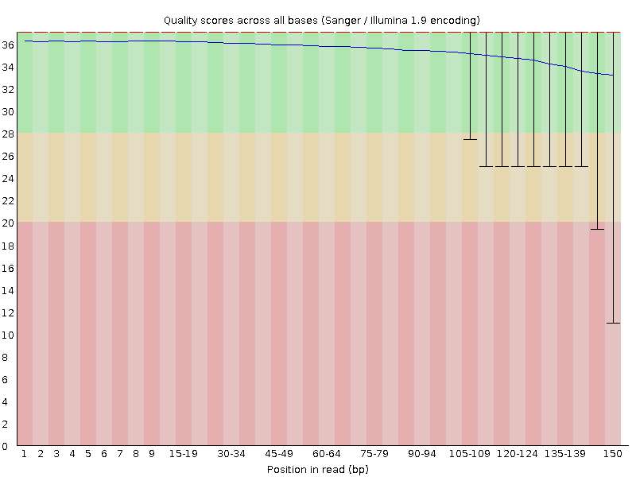
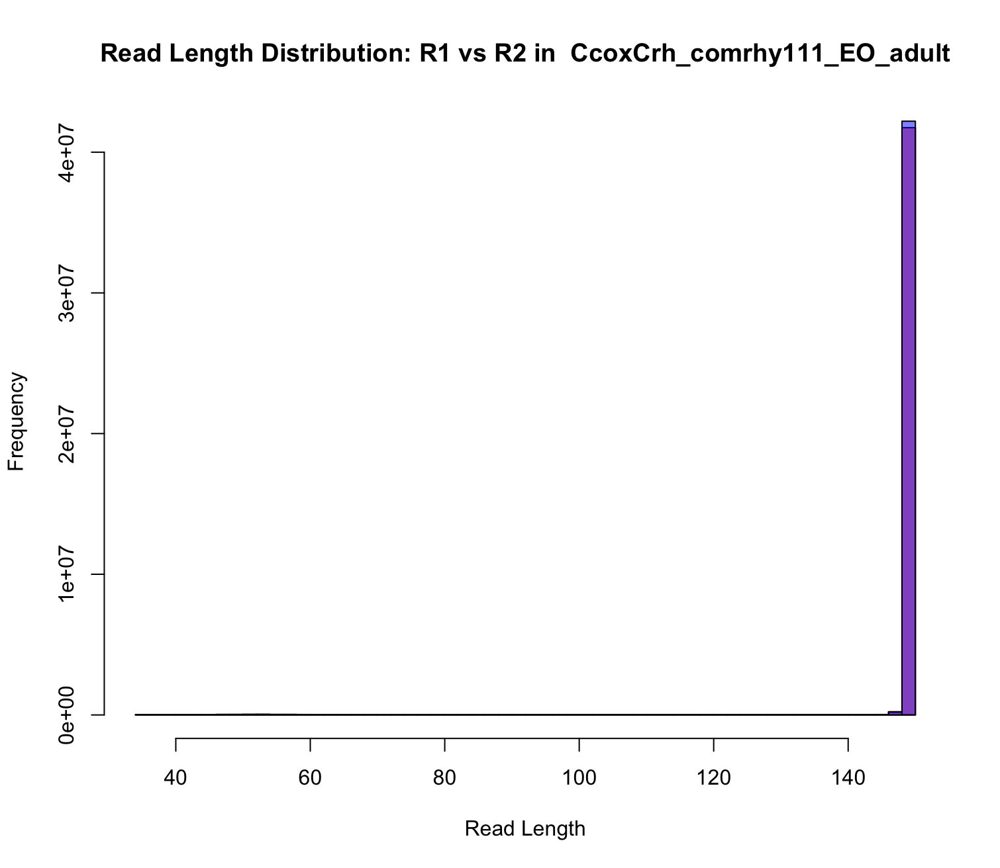

# RNA-seq Quality Assessment Assignment - Bi 623 (Summer 2025 Assignment/PS 2)
# Amanda Dougherty
# 2025-09-02    

# Lab Notebook RNA-seq Quality Assessment assignment (PS2) for Bi 623 (Summer 2025) 

## Overall assignment, from Rmd template:

- process electric organ and/or skeletal muscle RNA-seq reads for a future differential gene expression analysis
- learn how to use existing tools for quality assessment and read trimming
- compare quality assessments to those created by your own software
- learn how to align and count reads
- learn how to summarize important information in a high-level report
**Goal**: create a cohesive, well written report for your "PI" about what you've learned about/from your data

### Dataset:

* each have 2 unique RNA-seq files from two different electric fish studies (PRJNA1005245 and PRJNA1005244) 
SRR assignments are here: ```/projects/bgmp/shared/Bi623/PS2/QAA_data_Assignments.txt```.
    * my assignments: SRR25630296     Amanda
                      SRR25630382     Amanda

* methods for the PRJNA1005244 --> [published](https://doi.org/10.1093/molbev/msae021) 
* methods for the PRJNA1005245 --> third chapter of a [thesis](https://canvas.uoregon.edu/courses/266187/files/22059308?module_item_id=5380118). 

**<If you have extra time and want to take on one or more additional dataset(s), claim them 
via this googledoc https://docs.google.com/document/d/1vEmVEzUaTjbDF4JyNsWH-wFpi8dm4wkcvWgSoYZzoCY/edit?usp=sharing >**

**For all steps below, process the two libraries separately.** 

**You are responsible for downloading this data from NCBI SRA, dumping into FASTQ files, and zipping those files (check ICA1 for a refresher). We are processing this data for use in a future assignment, so please keep your files well organized.**

**Finally, rename the files to the convention: Species_sample_tissue_age/size_sample#_readnumber.fastq.gz.**

### Dowloading my data

environment where my sra toolkit is: 
    sra_bgmp               /gpfs/home/amdo/miniforge3/envs/sra_bgmp

downloaded all at once using shell script: 
    [sras](sra.sh)

```{bash, eval=FALSE}
# conda activate sra_bgmp 

# Downloading and converting SRA files to FASTQ format
# Using /usr/bin/time to measure resource usage
/usr/bin/time prefetch SRR25630296
/usr/bin/time fasterq-dump --split-files --threads 8 SRR25630296/SRR25630296.sra

# Downloading and converting SRA files to FASTQ format
# Using /usr/bin/time to measure resource usage
/usr/bin/time prefetch SRR25630382 
/usr/bin/time fasterq-dump --split-files --threads 8 SRR25630382/SRR25630382.sra


#  srun --account=bgmp --partition=bgmp -c 1 --time=1:00:00 --pty bash
```

output: 

        (sra_bgmp) [amdo@n0349 QAA]$ bash sra.sh 
        2025-09-02T18:30:38 prefetch.3.2.1: 1) Resolving 'SRR25630296'...
        2025-09-02T18:30:39 prefetch.3.2.1: Current preference is set to retrieve SRA Normalized Format files with full base quality scores
        2025-09-02T18:30:40 prefetch.3.2.1: 1) Downloading 'SRR25630296'...
        2025-09-02T18:30:40 prefetch.3.2.1:  SRA Normalized Format file is being retrieved
        2025-09-02T18:30:40 prefetch.3.2.1:  Downloading via HTTPS...
        2025-09-02T18:35:59 prefetch.3.2.1:  HTTPS download succeed
        2025-09-02T18:36:06 prefetch.3.2.1:  'SRR25630296' is valid: 4224032191 bytes were streamed from 4224028015
        2025-09-02T18:36:06 prefetch.3.2.1: 1) 'SRR25630296' was downloaded successfully
        2025-09-02T18:36:06 prefetch.3.2.1: 1) Resolving 'SRR25630296's dependencies...
        2025-09-02T18:36:06 prefetch.3.2.1: 'SRR25630296' has 0 unresolved dependencies
        31.66user 5.92system 5:28.89elapsed 11%CPU (0avgtext+0avgdata 56476maxresident)k
        0inputs+0outputs (0major+16310minor)pagefaults 0swaps
        spots read      : 43,867,295
        reads read      : 87,734,590
        reads written   : 87,734,590
        167.16user 19.12system 3:08.09elapsed 99%CPU (0avgtext+0avgdata 757216maxresident)k
        0inputs+0outputs (0major+658632minor)pagefaults 0swaps
        2025-09-02T18:39:15 prefetch.3.2.1: 1) Resolving 'SRR25630382'...
        2025-09-02T18:39:16 prefetch.3.2.1: Current preference is set to retrieve SRA Normalized Format files with full base quality scores
        2025-09-02T18:39:17 prefetch.3.2.1: 1) Downloading 'SRR25630382'...
        2025-09-02T18:39:17 prefetch.3.2.1:  SRA Normalized Format file is being retrieved
        2025-09-02T18:39:17 prefetch.3.2.1:  Downloading via HTTPS...
        2025-09-02T18:39:36 prefetch.3.2.1:  HTTPS download succeed
        2025-09-02T18:39:37 prefetch.3.2.1:  'SRR25630382' is valid: 690439501 bytes were streamed from 690434453
        2025-09-02T18:39:37 prefetch.3.2.1: 1) 'SRR25630382' was downloaded successfully
        2025-09-02T18:39:37 prefetch.3.2.1: 1) Resolving 'SRR25630382's dependencies...
        2025-09-02T18:39:37 prefetch.3.2.1: 'SRR25630382' has 0 unresolved dependencies
        5.09user 0.67system 0:22.83elapsed 25%CPU (0avgtext+0avgdata 56708maxresident)k
        0inputs+0outputs (0major+16315minor)pagefaults 0swaps
        spots read      : 6,975,938
        reads read      : 13,951,876
        reads written   : 13,951,876
        26.94user 2.49system 0:30.59elapsed 96%CPU (0avgtext+0avgdata 746340maxresident)k
        0inputs+0outputs (0major+269373minor)pagefaults 0swaps

output files: 

**SRR25630296**        
SRR25630296_1.fastq
SRR25630296_2.fastq

Campylomormyrus compressirostris x Campylomormyrus rhynchophorus

 spots read      : 43,867,295
        reads read      : 87,734,590
        reads written   : 87,734,590

**SRR25630382**
SRR25630382_1.fastq
SRR25630382_2.fastq

Campylomormyrus compressirostris x Campylomormyrus rhynchophorus

spots read      : 6,975,938
        reads read      : 13,951,876
        reads written   : 13,951,876

# 2025-09-03

**gzip files and renaming**

- frmt: Species_sample_tissue_age/size_sample#_readnumber.fastq.gz

**SRR25630296**
```{bash, eval=FALSE}
# started interactive srun ... 

gzip *.fastq

mv SRR25630296_1.fastq.gz CcoxCrh_comrhy61_EO_6cm_1_1.fastq.gz 
mv SRR25630296_2.fastq.gz CcoxCrh_comrhy61_EO_6cm_1_2.fastq.gz 

```

**SRR25630382**
```{bash, eval=FALSE}
# started interactive srun ... 

gzip *.fastq

mv SRR25630382_1.fastq.gz CcoxCrh_comrhy111_EO_adult_1_1.fastq.gz
mv SRR25630382_2.fastq.gz CcoxCrh_comrhy111_EO_adult_1_2.fastq.gz

```

- just doing it on srun was taking longer than i thought so i put it in a script: [gzip.sh](gzip.sh)

## Part 1 – Read quality score distributions

1. qaa environment and tool download

- created qaa environment
- install `FastQC`, `cutadapt`, and `Trimmomatic`

```{bash, eval=FALSE}
conda create -n qaa
conda activate qaa 

conda install -c bioconda fastqc 
conda install -c bioconda trimmomatic=0.39
conda install -c bioconda cutadapt

# cutadapt would not download with current python version so downgraded in the qaa environment:
conda install -c bioconda -c conda-forge cutadapt "python<3.12"

```

2. Using `FastQC` via the command line on Talapas, produce plots of the per-base quality score distributions for R1 and R2 reads. Also, produce plots of the per-base N content, and comment on whether or not they are consistent with the quality score plots.

[Include FastQC commands, plots of per-base N content, comments on consistency with quality score plots]

```{bash, eval=FALSE}
# to each .gz file: 

fastqc -o ./fastqc CcoxCrh_comrhy61_EO_6cm_1_1.fastq.gz  # read 1
fastqc -o ./fastqc CcoxCrh_comrhy61_EO_6cm_1_2.fastq.gz  # read 2
fastqc -o ./fastqc CcoxCrh_comrhy111_EO_adult_1_1.fastq.gz  # read 1
fastqc -o ./fastqc CcoxCrh_comrhy111_EO_adult_1_2.fastq.gz  # read 2

```

For **CcoxCrh_comrhy61_EO_6cm_1_1.fastq.gz**:


For **CcoxCrh_comrhy61_EO_6cm_1_2.fastq.gz**


For **CcoxCrh_comrhy111_EO_adult_1_1.fastq.gz**


For **CcoxCrh_comrhy111_EO_adult_1_2.fastq.gz**



3. Run your quality score plotting script from your Demultiplexing assignment in Bi622. (Make sure you're using the "running sum" strategy!!) Describe how the `FastQC` quality score distribution plots compare to your own. If different, propose an explanation. Also, does the run time differ? Mem/CPU usage? If so, why?

[Include quality score distribution plot, a comparison to FastQC, comments on any differences between your quality score plotting and FastQC]

--part1.2.py
--part1.2.sh
----imported bioinfo.py

**NEED TO ADD PLOTS**

a. CcoxCrh_comrhy61_EO_6cm_1_1.fastq.gz

b. CcoxCrh_comrhy61_EO_6cm_1_2.fastq.gz

c. CcoxCrh_comrhy111_EO_adult_1_1.fastq.gz

d. CcoxCrh_comrhy111_EO_adult_1_2.fastq.gz


4. Comment on the overall data quality of your two libraries. Go beyond per-base qscore distributions. Examine the `FastQC` [documentation](https://www.bioinformatics.babraham.ac.uk/projects/fastqc/Help/3%20Analysis%20Modules/) for guidance on interpreting results and planning next steps. Make and justify a recommendation on whether these data are of high enough quality to use for further analysis. 

[Include comments on data quality and recommendation on whether this can be used for further analysis]


# 2025-09-04
## Part 2 – Adaptor trimming comparison

- checking cutadapt and trimmomatic installations versions:\
    - `cutadapt --version` (should be 5.0)
    - `trimmomatic -version` (should be 0.39)

(qaa) [amdo@login4 fastqc]$ cutadapt --version
2.6
(qaa) [amdo@login4 fastqc]$ trimmomatic -version
0.39

```{bash, eval=FALSE}
# trying to get right version of cutadapt and right python for the download

conda install -c conda-forge cutadapt=5.0 "python=3.12"

```

- Now: 

(qaa) [amdo@login4 fastqc]$ cutadapt --version
5.0

(qaa) [amdo@login4 fastqc]$ python  --version

Python 3.12.11          

-- Using `Cutadapt`, properly trim adapter sequences from your assigned files. Be sure to read how to use `Cutadapt`. Use default settings. 


From cutadapt 5.0 manual:

    To trim a 3’ adapter, the basic command-line for Cutadapt is:

```cutadapt -a AACCGGTT -o output.fastq input.fastq.gz```

    The sequence of a 5’ adapter is given with the -a option. You need to replace AACCGGTT with the correct adapter sequence. Reads are read from the input file input.fastq and are written to the output file output.fastq.

Adapter sequences found here:

https://support-docs.illumina.com/SHARE/AdapterSequences/Content/SHARE/AdapterSeq/TruSeq/UDIndexes.htm

"The following sequences are used for adapter trimming:"

Read 1

AGATCGGAAGAGCACACGTCTGAACTCCAGTCA

Read 2

AGATCGGAAGAGCGTCGTGTAGGGAAAGAGTGT


    - *Sanity check*: Use your Unix skills to search for the adapter sequences in your datasets and confirm the expected sequence orientations. Report the commands you used, the reasoning behind them, and how you confirmed the adapter sequences.

For visually searching for the R1 and R2 adapters:\
```zcat CcoxCrh_comrhy111_EO_adult_1_1.fastq.gz | less -S | head -200``` 
```zcat CcoxCrh_comrhy111_EO_adult_1_2.fastq.gz | less -S | head -200```

Manually searching for the adapters: 
```zcat CcoxCrh_comrhy111_EO_adult_1_1.fastq.gz | grep "AGATCGGAAGAGCACACGTCTGAACTCCAGTCA" | wc -l```
470873
```zcat CcoxCrh_comrhy111_EO_adult_1_2.fastq.gz | grep "AGATCGGAAGAGCGTCGTGTAGGGAAAGAGTGT" | wc -l```
- but that is so few sequences it feels like that can't be right...


(base) [amdo@n0349 QAA]$ zcat CcoxCrh_comrhy111_EO_adult_1_1.fastq.gz | grep "AGATCGGAAGAGCACACGTCTGAACTCCAGTCA" | wc -l
470873
(base) [amdo@n0349 QAA]$ zcat CcoxCrh_comrhy111_EO_adult_1_2.fastq.gz | grep "AGATCGGAAGAGCGTCGTGTAGGGAAAGAGTGT" | wc -l
164550
- trying to reverse search the R1 and R2 on the opposite files:\
(base) [amdo@n0349 QAA]$ zcat CcoxCrh_comrhy111_EO_adult_1_2.fastq.gz | grep "AGATCGGAAGAGCACACGTCTGAACTCCAGTCA" | wc -l
0
(base) [amdo@n0349 QAA]$ zcat CcoxCrh_comrhy111_EO_adult_1_1.fastq.gz | grep "AGATCGGAAGAGCGTCGTGTAGGGAAAGAGTGT" | wc -l
0

[Include commands and report out the proportion of reads trimmed]    

```{bash, eval=FALSE}

cutadapt -a AGATCGGAAGAGCACACGTCTGAACTCCAGTCA -o CcoxCrh_comrhy111_EO_adult_1_1_TRIMMED.fastq CcoxCrh_comrhy111_EO_adult_1_1.fastq.gz

cutadapt -a AGATCGGAAGAGCGTCGTGTAGGGAAAGAGTGT -o CcoxCrh_comrhy111_EO_adult_1_2_TRIMMED.fastq CcoxCrh_comrhy111_EO_adult_1_2.fastq.gz


```

**Output 111_R1:** 


This is cutadapt 5.0 with Python 3.12.11
Command line parameters: -a AGATCGGAAGAGCACACGTCTGAACTCCAGTCA -o CcoxCrh_comrhy111_EO_adult_1_1_TRIMMED.fastq CcoxCrh_comrhy111_EO_adult_1_1.fastq.gz
Processing single-end reads on 1 core ...
Done           00:00:21     6,975,938 reads @   3.1 µs/read;  19.09 M reads/minute

=== Summary ===

Total reads processed:               6,975,938
Reads with adapters:                 1,514,521 (21.7%)
Reads written (passing filters):     6,975,938 (100.0%)

Total basepairs processed: 1,046,390,700 bp
Total written (filtered):  1,006,872,613 bp (96.2%)

=== Adapter 1 ===

Sequence: AGATCGGAAGAGCACACGTCTGAACTCCAGTCA; Type: regular 3'; Length: 33; Trimmed: 1514521 times

Minimum overlap: 3
No. of allowed errors:
1-9 bp: 0; 10-19 bp: 1; 20-29 bp: 2; 30-33 bp: 3

Bases preceding removed adapters:
  A: 11.1%
  C: 24.1%
  G: 50.4%
  T: 14.4%
  none/other: 0.0%

          Overview of removed sequences
          length  count   expect  max.err error counts
          3       123968  108999.0        0       123968
          4       53980   27249.8 0       53980
          5       36694   6812.4  0       36694
          6       32510   1703.1  0       32510
          7       31996   425.8   0       31996
          8       31139   106.4   0       31139
          9       32218   26.6    0       32079 139
          10      31175   6.7     1       30186 989
          11      31942   1.7     1       30849 1093
          12      31046   0.4     1       29927 1119
          13      31567   0.1     1       30400 1167
          14      31559   0.0     1       30265 1294
          15      32151   0.0     1       30843 1308
          16      30596   0.0     1       29219 1377
          17      30236   0.0     1       28747 1489
          18      29183   0.0     1       27607 1549 27
          19      29413   0.0     1       27745 1636 32
          20      29306   0.0     2       27557 1520 229
          21      28672   0.0     2       26866 1585 221
          22      28856   0.0     2       26924 1684 248
          23      28106   0.0     2       26301 1519 286
          24      28506   0.0     2       26480 1764 262
          25      27550   0.0     2       25583 1698 269
          26      26624   0.0     2       24583 1740 301
          27      27040   0.0     2       24935 1768 322 15
          28      25870   0.0     2       23848 1751 252 19
          29      25366   0.0     2       23374 1682 283 27
          30      24848   0.0     3       22810 1691 247 100
          31      24632   0.0     3       22493 1733 296 110
          32      24264   0.0     3       22228 1650 281 105
          33      24258   0.0     3       22224 1652 263 119
          34      23617   0.0     3       21533 1694 289 101
          35      22671   0.0     3       20754 1546 260 111
          36      22095   0.0     3       20178 1551 263 103
          37      22222   0.0     3       20286 1550 270 116
          38      21869   0.0     3       20005 1525 256 83
          39      20700   0.0     3       18978 1385 237 100
          40      20710   0.0     3       18956 1422 246 86
          41      19529   0.0     3       17932 1296 223 78
          42      18483   0.0     3       16916 1283 190 94
          43      18607   0.0     3       17096 1234 186 91
          44      17827   0.0     3       16328 1224 201 74
          45      17095   0.0     3       15682 1138 205 70
          46      16273   0.0     3       14899 1120 191 63
          47      15605   0.0     3       14303 1076 173 53
          48      14822   0.0     3       13577 1018 167 60
          49      14443   0.0     3       13286 953 145 59
          50      13292   0.0     3       12224 875 142 51
          51      12384   0.0     3       11382 829 122 51
          52      12115   0.0     3       11166 801 98 50
          53      11472   0.0     3       10529 784 108 51
          54      10995   0.0     3       10151 704 112 28
          55      10752   0.0     3       9899 723 89 41
          56      9382    0.0     3       8604 642 90 46
          57      8866    0.0     3       8149 578 102 37
          58      8405    0.0     3       7712 584 77 32
          59      7982    0.0     3       7372 494 74 42
          60      7155    0.0     3       6581 479 73 22
          61      6750    0.0     3       6238 431 56 25
          62      6049    0.0     3       5564 395 56 34
          63      5744    0.0     3       5267 392 61 24
          64      5152    0.0     3       4759 327 45 21
          65      5042    0.0     3       4680 308 37 17
          66      4269    0.0     3       3943 270 34 22
          67      3901    0.0     3       3574 263 50 14
          68      3478    0.0     3       3217 213 35 13
          69      3191    0.0     3       2937 211 26 17
          70      2864    0.0     3       2630 178 41 15
          71      2683    0.0     3       2458 192 24 9
          72      2235    0.0     3       2069 147 14 5
          73      1964    0.0     3       1827 117 14 6
          74      1746    0.0     3       1627 96 16 7
          75      1665    0.0     3       1549 100 13 3
          76      1485    0.0     3       1367 103 11 4
          77      1278    0.0     3       1196 64 14 4
          78      1164    0.0     3       1089 57 12 6
          79      957     0.0     3       875 69 3 10
          80      915     0.0     3       845 57 10 3
          81      811     0.0     3       750 43 11 7
          82      707     0.0     3       648 44 11 4
          83      664     0.0     3       606 46 4 8
          84      533     0.0     3       488 37 6 2
          85      536     0.0     3       489 33 11 3
          86      403     0.0     3       363 29 9 2
          87      423     0.0     3       388 30 2 3
          88      337     0.0     3       301 31 3 2
          89      325     0.0     3       308 15 1 1
          90      283     0.0     3       259 20 3 1
          91      286     0.0     3       255 25 5 1
          92      224     0.0     3       201 18 2 3
          93      224     0.0     3       206 14 4
          94      141     0.0     3       122 11 5 3
          95      136     0.0     3       117 13 4 2
          96      161     0.0     3       150 5 3 3
          97      120     0.0     3       107 8 5
          98      113     0.0     3       103 6 3 1
          99      90      0.0     3       79 7 3 1
          100     69      0.0     3       56 10 2 1
          101     68      0.0     3       58 8 1 1
          102     56      0.0     3       50 3 3
          103     55      0.0     3       45 8 1 1
          104     43      0.0     3       40 1 1 1
          105     39      0.0     3       38 1
          106     24      0.0     3       17 5 2
          107     24      0.0     3       19 1 4
          108     29      0.0     3       27 1 0 1
          109     31      0.0     3       28 3
          110     21      0.0     3       17 2 0 2
          111     22      0.0     3       16 4 2
          112     25      0.0     3       24 0 1
          113     14      0.0     3       13 0 1
          114     17      0.0     3       14 1 1 1
          115     9       0.0     3       7 2
          116     4       0.0     3       3 0 0 1
          117     11      0.0     3       10 0 0 1
          118     12      0.0     3       10 0 0 2
          119     5       0.0     3       3 0 1 1
          120     10      0.0     3       5 3 1 1
          121     6       0.0     3       5 1
          122     8       0.0     3       6 0 1 1
          123     2       0.0     3       0 2
          124     4       0.0     3       0 4
          125     1       0.0     3       1
          126     1       0.0     3       0 1
          127     4       0.0     3       2 0 2
          128     1       0.0     3       0 1
          129     3       0.0     3       1 2
          130     1       0.0     3       1
          134     1       0.0     3       0 0 0 1
          136     2       0.0     3       0 0 1 1
          138     1       0.0     3       0 0 1
          139     1       0.0     3       1
          140     1       0.0     3       1
          147     1       0.0     3       1
          150     207     0.0     3       0 190 12 5

**Output 111_R2:**

This is cutadapt 5.0 with Python 3.12.11
Command line parameters: -a AGATCGGAAGAGCGTCGTGTAGGGAAAGAGTGT -o CcoxCrh_comrhy111_EO_adult_1_2_TRIMMED.fastq CcoxCrh_comrhy111_EO_adult_1_2.fastq.gz
Processing single-end reads on 1 core ...
Done           00:00:22     6,975,938 reads @   3.3 µs/read;  18.36 M reads/minute

=== Summary ===

Total reads processed:               6,975,938
Reads with adapters:                 1,507,229 (21.6%)
Reads written (passing filters):     6,975,938 (100.0%)

Total basepairs processed: 1,046,390,700 bp. 
Total written (filtered):  1,008,903,486 bp (96.4%). 

=== Adapter 1 ===

Sequence: AGATCGGAAGAGCGTCGTGTAGGGAAAGAGTGT; Type: regular 3'; Length: 33; Trimmed: 1507229 times

Minimum overlap: 3
No. of allowed errors:
1-9 bp: 0; 10-19 bp: 1; 20-29 bp: 2; 30-33 bp: 3

Bases preceding removed adapters:
  A: 9.9%
  C: 25.1%
  G: 53.2%
  T: 11.9%
  none/other: 0.0%

          Overview of removed sequences
          length  count   expect  max.err error counts
          3       164639  108999.0        0       164639
          4       56716   27249.8 0       56716
          5       37659   6812.4  0       37659
          6       32890   1703.1  0       32890
          7       32128   425.8   0       32128
          8       31259   106.4   0       31259
          9       31625   26.6    0       31433 192
          10      31256   6.7     1       29616 1640
          11      32321   1.7     1       30731 1590
          12      31028   0.4     1       29587 1441
          13      31810   0.1     1       30285 1525
          14      31376   0.0     1       29852 1524
          15      32016   0.0     1       30304 1712
          16      30661   0.0     1       28938 1723
          17      30021   0.0     1       28471 1550
          18      28949   0.0     1       26913 2036
          19      29141   0.0     1       27079 2044 18
          20      29200   0.0     2       25546 3014 640
          21      28490   0.0     2       24911 2947 632
          22      28620   0.0     2       24808 3184 628
          23      27900   0.0     2       24284 3021 595
          24      28250   0.0     2       24547 3152 551
          25      27108   0.0     2       21320 4691 1097
          26      25951   0.0     2       19103 5417 1431
          27      25946   0.0     2       17676 6175 2094 1
          28      24850   0.0     2       17138 5736 1968 8
          29      24127   0.0     2       12835 7271 3188 833
          30      24069   0.0     3       12301 7228 3290 1250
          31      23241   0.0     3       10172 6833 4203 2033
          32      22822   0.0     3       10372 6429 3971 2050
          33      21524   0.0     3       6623 5888 5366 3647
          34      20920   0.0     3       6738 5823 5065 3294
          35      20316   0.0     3       6247 5962 5053 3054
          36      19641   0.0     3       6331 5421 4761 3128
          37      19910   0.0     3       6168 6053 4839 2850
          38      19685   0.0     3       6011 5732 5018 2924
          39      18790   0.0     3       6018 5862 4325 2585
          40      18723   0.0     3       5985 5796 4464 2478
          41      17801   0.0     3       6133 5239 4040 2389
          42      16848   0.0     3       5873 4857 3752 2366
          43      16960   0.0     3       5909 4852 3824 2375
          44      16304   0.0     3       5856 4767 3593 2088
          45      15692   0.0     3       5258 4687 3698 2049
          46      14826   0.0     3       4987 4383 3494 1962
          47      14384   0.0     3       4707 4393 3465 1819
          48      13639   0.0     3       4798 4146 3015 1680
          49      13420   0.0     3       4530 4217 3113 1560
          50      12337   0.0     3       4326 3741 2767 1503
          51      11522   0.0     3       3999 3879 2402 1242
          52      11234   0.0     3       4206 3374 2393 1261
          53      10658   0.0     3       3997 3232 2287 1142
          54      10298   0.0     3       3858 3207 2190 1043
          55      10052   0.0     3       3854 3070 1989 1139
          56      8811    0.0     3       3333 2640 1850 988
          57      8296    0.0     3       3209 2525 1738 824
          58      7848    0.0     3       3013 2374 1668 793
          59      7513    0.0     3       2841 2251 1637 784
          60      6717    0.0     3       2509 2163 1402 643
          61      6345    0.0     3       2359 2091 1245 650
          62      5724    0.0     3       2259 1833 1118 514
          63      5430    0.0     3       2112 1668 1136 514
          64      4892    0.0     3       2044 1481 903 464
          65      4777    0.0     3       1858 1523 942 454
          66      4084    0.0     3       1695 1289 772 328
          67      3707    0.0     3       1488 1149 689 381
          68      3324    0.0     3       1339 1030 676 279
          69      3049    0.0     3       1255 912 634 248
          70      2744    0.0     3       1048 905 557 234
          71      2562    0.0     3       1045 801 492 224
          72      2151    0.0     3       854 740 397 160
          73      1880    0.0     3       800 615 315 150
          74      1685    0.0     3       683 557 337 108
          75      1602    0.0     3       656 531 285 130
          76      1430    0.0     3       596 516 233 85
          77      1239    0.0     3       562 374 216 87
          78      1128    0.0     3       504 363 185 76
          79      921     0.0     3       394 301 149 77
          80      881     0.0     3       409 303 115 54
          81      776     0.0     3       354 251 113 58
          82      694     0.0     3       312 230 108 44
          83      643     0.0     3       308 208 94 33
          84      509     0.0     3       209 187 77 36
          85      520     0.0     3       258 147 82 33
          86      396     0.0     3       180 137 55 24
          87      417     0.0     3       204 125 71 17
          88      329     0.0     3       143 115 54 17
          89      315     0.0     3       169 103 32 11
          90      280     0.0     3       141 83 44 12
          91      281     0.0     3       143 90 36 12
          92      218     0.0     3       108 59 26 25
          93      221     0.0     3       106 70 34 11
          94      138     0.0     3       79 39 14 6
          95      129     0.0     3       70 41 12 6
          96      155     0.0     3       81 45 20 9
          97      114     0.0     3       49 42 18 5
          98      112     0.0     3       50 45 14 3
          99      89      0.0     3       43 27 9 10
          100     64      0.0     3       25 19 16 4
          101     67      0.0     3       29 26 7 5
          102     54      0.0     3       27 15 9 3
          103     54      0.0     3       26 18 7 3
          104     41      0.0     3       17 18 2 4
          105     39      0.0     3       18 15 4 2
          106     23      0.0     3       7 11 4 1
          107     23      0.0     3       11 6 5 1
          108     28      0.0     3       9 10 3 6
          109     31      0.0     3       14 10 5 2
          110     21      0.0     3       9 7 3 2
          111     19      0.0     3       10 6 2 1
          112     25      0.0     3       18 4 1 2
          113     14      0.0     3       7 3 4
          114     17      0.0     3       2 10 3 2
          115     9       0.0     3       3 1 1 4
          116     4       0.0     3       1 2 1
          117     11      0.0     3       4 5 1 1
          118     12      0.0     3       9 0 2 1
          119     3       0.0     3       3
          120     10      0.0     3       2 4 2 2
          121     6       0.0     3       3 1 1 1
          122     7       0.0     3       3 1 1 2
          123     4       0.0     3       0 1 0 3
          124     2       0.0     3       2
          125     2       0.0     3       1 0 0 1
          126     1       0.0     3       0 0 0 1
          127     2       0.0     3       2
          128     1       0.0     3       1
          129     3       0.0     3       1 1 1
          139     1       0.0     3       1
          140     1       0.0     3       1
          147     1       0.0     3       0 0 0 1


- Apparently I can do it all at once for both R1/R2: 
    trying for 61 1&2:

```
cutadapt \
    -a AGATCGGAAGAGCACACGTCTGAACTCCAGTCA \
    -A AGATCGGAAGAGCGTCGTGTAGGGAAAGAGTGT \
    -o trimmed_Cc61.R1.fastq.gz -p trimmed_Cc61.R2.fastq.gz \
    CcoxCrh_comrhy61_EO_6cm_1_1.fastq.gz CcoxCrh_comrhy61_EO_6cm_1_2.fastq.gz
```
**Output:** 

This is cutadapt 5.0 with Python 3.12.11
Command line parameters: -a AGATCGGAAGAGCACACGTCTGAACTCCAGTCA -A AGATCGGAAGAGCGTCGTGTAGGGAAAGAGTGT -o trimmed_Cc61.R1.fastq.gz -p trimmed_Cc61.R2.fastq.gz CcoxCrh_comrhy61_EO_6cm_1_1.fastq.gz CcoxCrh_comrhy61_EO_6cm_1_2.fastq.gz
Processing paired-end reads on 1 core ...
Done           00:06:54    43,867,295 reads @   9.4 µs/read;   6.35 M reads/minute

          === Summary ===

          Total read pairs processed:         43,867,295. 
            Read 1 with adapter:               3,528,795 (8.0%). 
            Read 2 with adapter:               3,809,704 (8.7%). 
          Pairs written (passing filters):    43,867,295 (100.0%). 

          Total basepairs processed: 13,160,188,500 bp
            Read 1: 6,580,094,250 bp
            Read 2: 6,580,094,250 bp
          Total written (filtered):  13,045,142,790 bp (99.1%)
            Read 1: 6,522,268,610 bp
            Read 2: 6,522,874,180 bp

          === First read: Adapter 1 ===

          Sequence: AGATCGGAAGAGCACACGTCTGAACTCCAGTCA; Type: regular 3'; Length: 33; Trimmed: 3528795 times

          Minimum overlap: 3
          No. of allowed errors:
          1-9 bp: 0; 10-19 bp: 1; 20-29 bp: 2; 30-33 bp: 3

          Bases preceding removed adapters:
            A: 13.1%
            C: 29.5%
            G: 41.1%
            T: 16.2%
            none/other: 0.2%

          Overview of removed sequences
          length  count   expect  max.err error counts
          3       791285  685426.5        0       791285
          4       261981  171356.6        0       261981
          5       137127  42839.2 0       137127
          6       105270  10709.8 0       105270
          7       98821   2677.4  0       98821
          8       94328   669.4   0       94328
          9       93056   167.3   0       92291 765
          10      91891   41.8    1       88197 3694
          11      90171   10.5    1       86639 3532
          12      86147   2.6     1       82576 3571
          13      83801   0.7     1       80243 3558
          14      83672   0.2     1       80043 3629
          15      82629   0.0     1       78906 3723
          16      76160   0.0     1       72364 3796
          17      73116   0.0     1       69420 3696
          18      69042   0.0     1       65346 3635 61
          19      66628   0.0     1       63030 3519 79
          20      65157   0.0     2       60967 3555 635
          21      62334   0.0     2       58252 3401 681
          22      60754   0.0     2       56710 3426 618
          23      57781   0.0     2       53760 3363 658
          24      55680   0.0     2       51703 3357 620
          25      52369   0.0     2       48367 3401 601
          26      49927   0.0     2       46320 3041 566
          27      47485   0.0     2       43741 3146 557 41
          28      45170   0.0     2       41413 3133 582 42
          29      42857   0.0     2       39218 3002 591 46
          30      39858   0.0     3       36205 2897 497 259
          31      38480   0.0     3       34806 2881 523 270
          32      35951   0.0     3       32622 2571 517 241
          33      34873   0.0     3       31508 2600 545 220
          34      32910   0.0     3       29747 2498 461 204
          35      30894   0.0     3       27905 2319 467 203
          36      28381   0.0     3       25601 2155 424 201
          37      27818   0.0     3       25037 2193 422 166
          38      25686   0.0     3       23171 1947 366 202
          39      23681   0.0     3       21265 1932 340 144
          40      21990   0.0     3       19842 1697 296 155
          41      20586   0.0     3       18486 1623 328 149
          42      18806   0.0     3       16970 1440 274 122
          43      17886   0.0     3       16110 1410 244 122
          44      16562   0.0     3       14846 1365 231 120
          45      15436   0.0     3       13899 1190 248 99
          46      13862   0.0     3       12452 1152 187 71
          47      12964   0.0     3       11755 946 181 82
          48      11855   0.0     3       10663 937 179 76
          49      11117   0.0     3       9934 937 154 92
          50      9994    0.0     3       8941 832 154 67
          51      8663    0.0     3       7768 716 117 62
          52      8072    0.0     3       7229 658 126 59
          53      7614    0.0     3       6769 663 111 71
          54      7142    0.0     3       6268 670 144 60
          55      6406    0.0     3       5666 563 115 62
          56      5884    0.0     3       5238 513 85 48
          57      5119    0.0     3       4500 470 96 53
          58      4680    0.0     3       4047 488 90 55
          59      4193    0.0     3       3640 406 105 42
          60      3729    0.0     3       3263 353 68 45
          61      3343    0.0     3       2908 339 59 37
          62      3050    0.0     3       2644 316 56 34
          63      2800    0.0     3       2364 322 79 35
          64      2474    0.0     3       2094 290 49 41
          65      2268    0.0     3       1887 269 66 46
          66      2179    0.0     3       1820 268 56 35
          67      1990    0.0     3       1632 266 54 38
          68      1726    0.0     3       1406 225 64 31
          69      1443    0.0     3       1167 202 43 31
          70      1448    0.0     3       1143 223 54 28
          71      1382    0.0     3       1069 223 54 36
          72      1158    0.0     3       909 193 36 20
          73      1082    0.0     3       775 216 58 33
          74      969     0.0     3       709 194 42 24
          75      816     0.0     3       578 182 34 22
          76      845     0.0     3       616 174 36 19
          77      754     0.0     3       536 150 34 34
          78      764     0.0     3       498 189 40 37
          79      776     0.0     3       543 161 38 34
          80      726     0.0     3       474 160 45 47
          81      609     0.0     3       394 159 41 15
          82      561     0.0     3       363 135 36 27
          83      548     0.0     3       357 142 30 19
          84      570     0.0     3       312 188 41 29
          85      454     0.0     3       282 105 36 31
          86      424     0.0     3       256 130 20 18
          87      509     0.0     3       284 168 31 26
          88      455     0.0     3       263 140 31 21
          89      423     0.0     3       264 118 23 18
          90      451     0.0     3       261 142 27 21
          91      423     0.0     3       259 107 40 17
          92      371     0.0     3       203 110 35 23
          93      395     0.0     3       215 129 25 26
          94      344     0.0     3       190 114 27 13
          95      314     0.0     3       169 102 30 13
          96      283     0.0     3       152 101 16 14
          97      318     0.0     3       170 106 21 21
          98      331     0.0     3       187 101 29 14
          99      320     0.0     3       169 111 24 16
          100     273     0.0     3       128 101 20 24
          101     297     0.0     3       166 90 27 14
          102     264     0.0     3       147 97 10 10
          103     294     0.0     3       153 109 15 17
          104     258     0.0     3       141 88 18 11
          105     264     0.0     3       145 92 16 11
          106     197     0.0     3       103 71 15 8
          107     227     0.0     3       111 82 25 9
          108     220     0.0     3       106 77 18 19
          109     181     0.0     3       104 54 12 11
          110     209     0.0     3       101 87 10 11
          111     198     0.0     3       103 70 20 5
          112     172     0.0     3       88 59 16 9
          113     152     0.0     3       78 59 8 7
          114     179     0.0     3       99 54 18 8
          115     187     0.0     3       91 64 21 11
          116     164     0.0     3       88 54 13 9
          117     182     0.0     3       102 53 17 10
          118     169     0.0     3       95 56 14 4
          119     158     0.0     3       79 60 11 8
          120     174     0.0     3       95 52 17 10
          121     169     0.0     3       84 56 14 15
          122     111     0.0     3       59 41 6 5
          123     88      0.0     3       49 32 4 3
          124     119     0.0     3       50 54 9 6
          125     100     0.0     3       56 30 9 5
          126     99      0.0     3       43 39 12 5
          127     97      0.0     3       53 30 7 7
          128     103     0.0     3       60 34 5 4
          129     79      0.0     3       44 33 2
          130     81      0.0     3       46 28 4 3
          131     67      0.0     3       35 27 4 1
          132     56      0.0     3       26 24 4 2
          133     56      0.0     3       32 19 3 2
          134     90      0.0     3       27 58 3 2
          135     43      0.0     3       17 23 2 1
          136     156     0.0     3       19 121 15 1
          137     386     0.0     3       23 333 26 4
          138     63      0.0     3       14 46 2 1
          139     448     0.0     3       15 404 25 4
          140     60      0.0     3       50 10
          141     21      0.0     3       6 15
          142     32      0.0     3       25 3 1 3
          143     29      0.0     3       18 8 2 1
          144     23      0.0     3       8 12 2 1
          145     9       0.0     3       3 3 2 1
          146     17      0.0     3       10 4 1 2
          147     17      0.0     3       5 5 4 3
          148     14      0.0     3       3 4 5 2
          149     14      0.0     3       2 4 2 6
          150     5902    0.0     3       190 5296 376 40


          === Second read: Adapter 2 ===

          Sequence: AGATCGGAAGAGCGTCGTGTAGGGAAAGAGTGT; Type: regular 3'; Length: 33; Trimmed: 3809704 times

          Minimum overlap: 3
          No. of allowed errors:
          1-9 bp: 0; 10-19 bp: 1; 20-29 bp: 2; 30-33 bp: 3

          Bases preceding removed adapters:
            A: 13.4%
            C: 29.1%
            G: 44.5%
            T: 13.1%
            none/other: 0.0%

          Overview of removed sequences
          length  count   expect  max.err error counts
          3       1046964 685426.5        0       1046964
          4       288608  171356.6        0       288608
          5       145986  42839.2 0       145986
          6       109120  10709.8 0       109120
          7       100449  2677.4  0       100449
          8       95337   669.4   0       95337
          9       92408   167.3   0       91079 1329
          10      92326   41.8    1       87828 4498
          11      91427   10.5    1       87132 4295
          12      86353   2.6     1       82633 3720
          13      84876   0.7     1       81307 3569
          14      83703   0.2     1       80400 3303
          15      82426   0.0     1       78931 3495
          16      76633   0.0     1       73384 3249
          17      72880   0.0     1       69523 3357
          18      69000   0.0     1       64261 4738 1
          19      66252   0.0     1       61880 4344 28
          20      64753   0.0     2       58564 5111 1078
          21      61930   0.0     2       56119 4734 1077
          22      60200   0.0     2       54601 4654 945
          23      57534   0.0     2       51963 4530 1041
          24      55386   0.0     2       50351 4100 935
          25      51902   0.0     2       46820 4091 991
          26      49462   0.0     2       43038 5346 1078
          27      46997   0.0     2       40954 4936 1104 3
          28      44787   0.0     2       38879 4828 1076 4
          29      42332   0.0     2       36795 4511 1010 16
          30      39696   0.0     3       34246 4147 877 426
          31      38229   0.0     3       33047 3914 872 396
          32      35818   0.0     3       31037 3582 807 392
          33      34647   0.0     3       30053 3408 831 355
          34      32626   0.0     3       28235 3304 743 344
          35      30619   0.0     3       26387 3184 725 323
          36      28115   0.0     3       24408 2807 615 285
          37      27626   0.0     3       24085 2650 634 257
          38      25512   0.0     3       22205 2462 575 270
          39      23485   0.0     3       20449 2265 515 256
          40      21812   0.0     3       18991 2076 515 230
          41      20448   0.0     3       17816 1927 452 253
          42      18596   0.0     3       16292 1709 397 198
          43      17776   0.0     3       15625 1570 381 200
          44      16461   0.0     3       14333 1559 398 171
          45      15340   0.0     3       13431 1420 343 146
          46      13711   0.0     3       11958 1280 311 162
          47      12865   0.0     3       11275 1166 285 139
          48      11760   0.0     3       10331 1063 243 123
          49      11071   0.0     3       9661 976 285 149
          50      9888    0.0     3       8669 876 220 123
          51      8534    0.0     3       7582 703 164 85
          52      7979    0.0     3       7047 659 167 106
          53      7529    0.0     3       6640 657 147 85
          54      7000    0.0     3       6180 605 133 82
          55      6340    0.0     3       5553 576 139 72
          56      5805    0.0     3       5042 535 160 68
          57      4986    0.0     3       4374 426 106 80
          58      4567    0.0     3       3982 416 103 66
          59      4072    0.0     3       3571 341 101 59
          60      3655    0.0     3       3166 305 113 71
          61      3262    0.0     3       2831 283 100 48
          62      2954    0.0     3       2546 271 86 51
          63      2704    0.0     3       2355 222 68 59
          64      2386    0.0     3       2066 190 90 40
          65      2206    0.0     3       1887 189 77 53
          66      2131    0.0     3       1819 181 77 54
          67      1926    0.0     3       1640 162 68 56
          68      1674    0.0     3       1427 134 64 49
          69      1409    0.0     3       1164 135 56 54
          70      1400    0.0     3       1157 137 56 50
          71      1323    0.0     3       1083 132 50 58
          72      1105    0.0     3       913 111 38 43
          73      1007    0.0     3       790 122 43 52
          74      952     0.0     3       736 111 62 43
          75      775     0.0     3       603 93 46 33
          76      778     0.0     3       629 77 38 34
          77      713     0.0     3       532 97 52 32
          78      665     0.0     3       519 76 36 34
          79      751     0.0     3       537 113 60 41
          80      680     0.0     3       474 108 49 49
          81      556     0.0     3       409 68 46 33
          82      551     0.0     3       385 72 54 40
          83      495     0.0     3       363 57 44 31
          84      487     0.0     3       332 66 51 38
          85      432     0.0     3       300 65 38 29
          86      375     0.0     3       274 47 30 24
          87      442     0.0     3       310 58 44 30
          88      377     0.0     3       274 57 26 20
          89      397     0.0     3       278 55 36 28
          90      417     0.0     3       276 71 47 23
          91      386     0.0     3       276 61 23 26
          92      327     0.0     3       220 41 36 30
          93      328     0.0     3       245 43 22 18
          94      280     0.0     3       185 48 28 19
          95      279     0.0     3       183 49 24 23
          96      256     0.0     3       154 47 31 24
          97      283     0.0     3       185 42 22 34
          98      293     0.0     3       202 43 28 20
          99      267     0.0     3       188 37 22 20
          100     216     0.0     3       130 51 21 14
          101     243     0.0     3       175 34 21 13
          102     229     0.0     3       153 36 22 18
          103     239     0.0     3       167 36 18 18
          104     206     0.0     3       147 33 12 14
          105     217     0.0     3       140 39 19 19
          106     153     0.0     3       100 15 21 17
          107     198     0.0     3       137 26 22 13
          108     190     0.0     3       122 38 14 16
          109     167     0.0     3       103 31 17 16
          110     152     0.0     3       115 9 13 15
          111     164     0.0     3       106 32 11 15
          112     143     0.0     3       92 23 13 15
          113     128     0.0     3       92 17 9 10
          114     153     0.0     3       116 12 16 9
          115     149     0.0     3       98 20 16 15
          116     143     0.0     3       96 16 15 16
          117     144     0.0     3       96 21 17 10
          118     136     0.0     3       90 20 16 10
          119     124     0.0     3       84 20 13 7
          120     143     0.0     3       92 30 13 8
          121     154     0.0     3       94 26 18 16
          122     78      0.0     3       59 10 5 4
          123     69      0.0     3       50 6 6 7
          124     91      0.0     3       56 16 7 12
          125     85      0.0     3       59 15 7 4
          126     73      0.0     3       43 14 9 7
          127     78      0.0     3       58 9 7 4
          128     77      0.0     3       56 9 6 6
          129     58      0.0     3       49 6 3
          130     57      0.0     3       46 6 5
          131     39      0.0     3       34 5
          132     30      0.0     3       22 4 3 1
          133     41      0.0     3       31 8 1 1
          134     38      0.0     3       32 5 1
          135     22      0.0     3       19 3
          136     23      0.0     3       20 3
          137     23      0.0     3       21 2
          138     16      0.0     3       15 1
          139     22      0.0     3       21 0 1
          140     52      0.0     3       48 4
          141     7       0.0     3       7
          142     27      0.0     3       26 0 1
          143     19      0.0     3       15 4
          144     8       0.0     3       6 2
          145     5       0.0     3       5
          146     10      0.0     3       10
          147     9       0.0     3       7 1 1
          148     3       0.0     3       3
          149     3       0.0     3       2 1
          150     222     0.0     3       205 11 6

# ---------------------------------------------------------

**What proportion of reads (both R1 and R2) were trimmed?**

**111_R1** 

=== Summary ===

Total reads processed:               6,975,938
Reads with adapters:                 1,514,521 (21.7%)
Reads written (passing filters):     6,975,938 (100.0%)

Total basepairs processed: 1,046,390,700 bp
Total written (filtered):  1,006,872,613 bp (96.2%)

**111_R2**

=== Summary ===

Total reads processed:               6,975,938
Reads with adapters:                 1,507,229 (21.6%)
Reads written (passing filters):     6,975,938 (100.0%)

Total basepairs processed: 1,046,390,700 bp
Total written (filtered):  1,008,903,486 bp (96.4%)

**61_R1**

=== Summary ===

Total read pairs processed:         43,867,295
  Read 1 with adapter:               3,528,795 (8.0%)
Pairs written (passing filters):    43,867,295 (100.0%)

Total basepairs processed: 13,160,188,500 bp
  Read 1: 6,580,094,250 bp
  Read 2: 6,580,094,250 bp
Total written (filtered):  13,045,142,790 bp (99.1%)
  Read 1: 6,522,268,610 bp
  Read 2: 6,522,874,180 bp

**61_R2**

=== Summary ===

Total read pairs processed:         43,867,295
Read 2 with adapter:               3,809,704 (8.7%)
Pairs written (passing filters):    43,867,295 (100.0%)

Total basepairs processed: 13,160,188,500 bp
  Read 1: 6,580,094,250 bp
  Read 2: 6,580,094,250 bp
Total written (filtered):  13,045,142,790 bp (99.1%)
  Read 1: 6,522,268,610 bp
  Read 2: 6,522,874,180 bp




# 09-05-25


7. Use `Trimmomatic` to quality trim your reads. Specify the following, **in this order**:
    - LEADING: quality of 3
    - TRAILING: quality of 3
    - SLIDING WINDOW: window size of 5 and required quality of 15
    - MINLENGTH: 35 bases

    Be sure to output compressed files and clear out all intermediate files.
ex: LEADING=3
```{bash, eval=FALSE}

# for Ccom61 R1/R2:

trimmomatic PE \
CcoxCrh_comrhy61_EO_6cm_1_1.fastq.gz \
  CcoxCrh_comrhy61_EO_6cm_1_2.fastq.gz \
  CcoxCrh_comrhy61_EO_6cm_1_1_paired.fq.gz \
  CcoxCrh_comrhy61_EO_6cm_1_1_unpaired.fq.gz \
  CcoxCrh_comrhy61_EO_6cm_1_2_paired.fq.gz \
  CcoxCrh_comrhy61_EO_6cm_1_2_unpaired.fq.gz \
  LEADING:3 \
  TRAILING:3 \
  SLIDINGWINDOW:5:15 \
  MINLEN:35
```
Output: 


TrimmomaticPE: Started with arguments:
 CcoxCrh_comrhy61_EO_6cm_1_1.fastq.gz CcoxCrh_comrhy61_EO_6cm_1_2.fastq.gz CcoxCrh_comrhy61_EO_6cm_1_1_paired.fq.gz CcoxCrh_comrhy61_EO_6cm_1_1_unpaired.fq.gz CcoxCrh_comrhy61_EO_6cm_1_2_paired.fq.gz CcoxCrh_comrhy61_EO_6cm_1_2_unpaired.fq.gz LEADING:3 TRAILING:3 SLIDINGWINDOW:5:15 MINLEN:35
Quality encoding detected as phred33

Input Read Pairs: 43867295 Both Surviving: 43490471 (99.14%) Forward Only Surviving: 227718 (0.52%) Reverse Only Surviving: 137300 (0.31%) Dropped: 11806 (0.03%)
TrimmomaticPE: Completed successfully


```{bash, eval=FALSE}

# for Ccom111 R1/R2

trimmomatic PE \
CcoxCrh_comrhy111_EO_adult_1_1.fastq.gz \
  CcoxCrh_comrhy111_EO_adult_1_2.fastq.gz \
  CcoxCrh_comrhy111_EO_adult_1_1_paired.fq.gz \
  CcoxCrh_comrhy111_EO_adult_1_1_unpaired.fq.gz \
  CcoxCrh_comrhy111_EO_adult_1_2_paired.fq.gz \
  CcoxCrh_comrhy111_EO_adult_1_2_unpaired.fq.gz \
  LEADING:3 \
  TRAILING:3 \
  SLIDINGWINDOW:5:15 \
  MINLEN:35

```
Output: 
TrimmomaticPE: Started with arguments:
 CcoxCrh_comrhy111_EO_adult_1_1.fastq.gz CcoxCrh_comrhy111_EO_adult_1_2.fastq.gz CcoxCrh_comrhy111_EO_adult_1_1_paired.fq.gz CcoxCrh_comrhy111_EO_adult_1_1_unpaired.fq.gz CcoxCrh_comrhy111_EO_adult_1_2_paired.fq.gz CcoxCrh_comrhy111_EO_adult_1_2_unpaired.fq.gz LEADING:3 TRAILING:3 SLIDINGWINDOW:5:15 MINLEN:35
Quality encoding detected as phred33
Input Read Pairs: 6975938 Both Surviving: 6908440 (99.03%) Forward Only Surviving: 49139 (0.70%) Reverse Only Surviving: 16587 (0.24%) Dropped: 1772 (0.03%)
TrimmomaticPE: Completed successfully

8. Plot the trimmed read length distributions for both paired R1 and paired R2 reads --> same plot!

```{R, eval=TRUE}
# getting trimmed files on home computer to draw up graphs on RStudio: 

scp amdo@login.talapas.uoregon.edu:/projects/bgmp/amdo/bioinfo/Bi623/PS2/QAA/CcoxCrh_comrhy61_EO_6cm_1_1_paired.fq.gz .
scp amdo@login.talapas.uoregon.edu:/projects/bgmp/amdo/bioinfo/Bi623/PS2/QAA/CcoxCrh_comrhy61_EO_6cm_1_2_paired.fq.gz .

scp amdo@login.talapas.uoregon.edu:/projects/bgmp/amdo/bioinfo/Bi623/PS2/QAA/CcoxCrh_comrhy111_EO_adult_1_1_paired.fq.gz .
scp amdo@login.talapas.uoregon.edu:/projects/bgmp/amdo/bioinfo/Bi623/PS2/QAA/CcoxCrh_comrhy111_EO_adult_1_2_paired.fq.gz .

```

from: ICA4 from Bi621 

to get read length distribution(from ica4 bi621)

```gzcat CcoxCrh_comrhy111_EO_adult_1_1_paired.fq.gz | grep -A 1 "^@" | grep -v "^@" | grep -v '^--' | awk '{print length($0)}' | sort | uniq -c | sort -n > Ccom111_R1_trimmed_data```

```gzcat CcoxCrh_comrhy111_EO_adult_1_2_paired.fq.gz | grep -A 1 "^@" | grep -v "^@" | grep -v '^--' | awk '{print length($0)}' | sort | uniq -c | sort -n > Ccom111_R2_trimmed_data```

```gzcat CcoxCrh_comrhy61_EO_6cm_1_1_paired.fq.gz | grep -A 1 "^@" | grep -v "^@" | grep -v '^--' | awk '{print length($0)}' | sort | uniq -c | sort -n > Ccom61_R1_trimmed_data```

```gzcat CcoxCrh_comrhy61_EO_6cm_1_2_paired.fq.gz | grep -A 1 "^@" | grep -v "^@" | grep -v '^--' | awk '{print length($0)}' | sort | uniq -c | sort -n > Ccom61_R2_trimmed_data```

Turning all those into csv's so i can load them into R (could have done this all in one command but i am le tired i guess)

```awk '{print $2","$1}' Ccom111_R1_trimmed_data > Ccom111_R1_trimmed.csv```

```awk '{print $2","$1}' Ccom111_R2_trimmed_data > Ccom111_R2_trimmed.csv```

```awk '{print $2","$1}' Ccom61_R1_trimmed_data > Ccom61_R1_trimmed.csv```

```awk '{print $2","$1}' Ccom61_R2_trimmed_data > Ccom61_R2_trimmed.csv```

You can produce 2 different plots for your 2 different RNA-seq samples. 
--> plots created in R: Ps2Plots.R

**need to start Rmd file for report, embed plots.   
pdf->png?

[Include your plot and comment on R1/R2 adapter trimming]--> **add comments for this** 


9. Bonus - Run `FastQC` on your trimmed data. Comment on differences you observe between the trimmed and untrimmed data. Include any figures needed to support your conclusions.

[Include command, comments on differences, and plot/s]

-- put all in fastqc_trimmed.sh
*output:* 
application/gzip
Analysis complete for CcoxCrh_comrhy61_EO_6cm_1_1_paired.fq.gz
application/gzip
Analysis complete for CcoxCrh_comrhy61_EO_6cm_1_2_paired.fq.gz
application/gzip
Analysis complete for CcoxCrh_comrhy111_EO_adult_1_1_paired.fq.gz
application/gzip
Analysis complete for CcoxCrh_comrhy111_EO_adult_1_2_paired.fq.gz

```{bash, eval=FALSE}

fastqc -o ./fastqc_trimmed CcoxCrh_comrhy61_EO_6cm_1_1_paired.fq.gz

fastqc -o ./fastqc_trimmed CcoxCrh_comrhy61_EO_6cm_1_2_paired.fq.gz

fastqc -o ./fastqc_trimmed CcoxCrh_comrhy111_EO_adult_1_1_paired.fq.gz

fastqc -o ./fastqc_trimmed CcoxCrh_comrhy111_EO_adult_1_2_paired.fq.gz

```

## Part 3 – Alignment and strand-specificity
10. additional software to install: 

    - Star
    - Picard
    - Samtools
    - NumPy
    - Matplotlib
    - HTSeq


```{bash, eval=FALSE}

conda activate qaa
conda install bioconda::star
conda install bioconda::picard
conda install bioconda::samtools
conda install conda-forge::numpy
conda install conda-forge::matplotlib
conda install bioconda::htseq

```

11. - Downloaded *Campylomormyrus compressirostris* genome fasta and gff file from :
  [Dryad](https://datadryad.org/dataset/doi:10.5061/dryad.c59zw3rcj) 

    download failed, copied files from: `/projects/bgmp/shared/Bi623/PS2/campylomormyrus.fasta`, `/projects/bgmp/shared/Bi623/PS2/campylomormyrus.gff`. 
  
  ```{bash, eval=FALSE}

  mkdir part3
  wget https://datadryad.org/downloads/file_stream/2058656

  # denied, forbidden? 

  cp /projects/bgmp/shared/Bi623/PS2/campylomormyrus.fasta . 
  cp /projects/bgmp/shared/Bi623/PS2/campylomormyrus.gff . 

  ```
  
Need gtf for STAR. 
- convert gff --> gtf   
```conda install conda-forge::cufflinks-py```. 
- that failed so trying:  
```conda create -n agat``` --activate to use to convert the file. 
```conda install -c bioconda agat```. 
-- sbatched agat.sh for below code because srun kept killing the job
```agat_convert_sp_gff2gtf.pl --gff campylomormyrus.gff -o campylomormyrus.gtf```. 
output file: [agat_output](part3/PS2_agat_38029014.out)
 
- generate an alignment database from it. 
-- ran star.sh for database creation

- Align the reads to your *C. compressirostris* database using a splice-aware aligner. 
-- ran staralign.sh 

-> used PS8 settings

First:
  > [!IMPORTANT]
  > You will need to use gene models to perform splice-aware alignment, see PS8 from Bi621. You may need to convert the gff file into a gtf file for this to work successfully.

[Record details on how you downloaded the genome, prepared the dataset for alignment, and commands for generating the alignment database and aligning reads]
  
```{bash, eval=FALSE}
# in star.sh script: 

/usr/bin/time -v STAR \
    --runThreadN 8 \
    --runMode genomeGenerate \
    --genomeDir /projects/bgmp/amdo/bioinfo/Bi621/PS/ps8-amdough/Danio_rerio.GRCz11.dna.ens114.STAR_2.7.11b \
    --genomeFastaFiles /projects/bgmp/amdo/bioinfo/Bi623/PS2/QAA/part3/campylomormyrus.fasta \
    --sjdbGTFfile /projects/bgmp/amdo/bioinfo/Bi623/PS2/QAA/part3/campylomormyrus.gtf \

```

output:

      !!!!! WARNING: --genomeSAindexNbases 14 is too large for the genome size=862592683, which may cause seg-fault at the mapping step. Re-run genome generation with recommended --genomeSAindexNbases 13
        Command being timed: "STAR --runThreadN 8 --runMode genomeGenerate --genomeDir /projects/bgmp/amdo/bioinfo/Bi623/PS2/QAA/part3/campylomormyrus_STAR_2.7.11b --genomeFastaFiles /projects/bgmp/amdo/bioinfo/Bi623/PS2/QAA/part3/campylomormyrus.fasta --sjdbGTFfile /projects/bgmp/amdo/bioinfo/Bi623/PS2/QAA/part3/campylomormyrus.gtf"
        User time (seconds): 1442.01
        System time (seconds): 35.60
        Percent of CPU this job got: 372%
        Elapsed (wall clock) time (h:mm:ss or m:ss): 6:36.29
        Average shared text size (kbytes): 0
        Average unshared data size (kbytes): 0
        Average stack size (kbytes): 0
        Average total size (kbytes): 0
        Maximum resident set size (kbytes): 23940248
        Average resident set size (kbytes): 0
        Major (requiring I/O) page faults: 0
        Minor (reclaiming a frame) page faults: 15263471
        Voluntary context switches: 10719
        Involuntary context switches: 2836
        Swaps: 0
        File system inputs: 0
        File system outputs: 0
        Socket messages sent: 0
        Socket messages received: 0
        Signals delivered: 0
        Page size (bytes): 4096
        Exit status: 0


```{bash, eval=FALSE}
# in staralign.sh script: 
# repeated for Ccom111 in same script 

mamba activate qaa

readFilesIn_1=/projects/bgmp/amdo/bioinfo/Bi623/PS2/QAA/CcoxCrh_comrhy61_EO_6cm_1_1_paired.fq.gz
readFilesIn_2=/projects/bgmp/amdo/bioinfo/Bi623/PS2/QAA/CcoxCrh_comrhy61_EO_6cm_1_2_paired.fq.gz
genomeDir=/projects/bgmp/amdo/bioinfo/Bi623/PS2/QAA/part3/campylomormyrus_STAR_2.7.11b
outDir=Ccom61_run1
outFileNamePrefix=$outDir/campySTARalign_Ccom61_

mkdir -p $outDir


/usr/bin/time -v STAR --runThreadN 8 --runMode alignReads \
    --outFilterMultimapNmax 3 \
    --outSAMunmapped Within KeepPairs \
    --alignIntronMax 1000000 --alignMatesGapMax 1000000 \
    --readFilesCommand zcat \
    --readFilesIn $readFilesIn_1 $readFilesIn_2 \
    --genomeDir $genomeDir \
    --outFileNamePrefix $outFileNamePrefix \
    --outSAMtype BAM SortedByCoordinate \     # need bam for picard so using extra specifications
    --outSAMattributes Standard

#Ccom111


mamba activate qaa

readFilesIn_1=/projects/bgmp/amdo/bioinfo/Bi623/PS2/QAA/CcoxCrh_comrhy111_EO_adult_1_1_paired.fq.gz
readFilesIn_2=/projects/bgmp/amdo/bioinfo/Bi623/PS2/QAA/CcoxCrh_comrhy111_EO_adult_1_2_paired.fq.gz
genomeDir=/projects/bgmp/amdo/bioinfo/Bi623/PS2/QAA/part3/campylomormyrus_STAR_2.7.11b
outDir=Ccom111_run1
outFileNamePrefix=$outDir/campySTARalign_Ccom111_

mkdir -p $outDir


/usr/bin/time -v STAR --runThreadN 8 --runMode alignReads \
    --outFilterMultimapNmax 3 \
    --outSAMunmapped Within KeepPairs \
    --alignIntronMax 1000000 --alignMatesGapMax 1000000 \
    --readFilesCommand zcat \
    --readFilesIn $readFilesIn_1 $readFilesIn_2 \
    --genomeDir $genomeDir \
    --outFileNamePrefix $outFileNamePrefix \
    --outSAMtype BAM SortedByCoordinate \
    --outSAMattributes Standard


```

output Ccom111:

	Command being timed: "STAR --runThreadN 8 --runMode alignReads --outFilterMultimapNmax 3 --outSAMunmapped Within KeepPairs --alignIntronMax 1000000 --alignMatesGapMax 1000000 --readFilesCommand zcat --readFilesIn /projects/bgmp/amdo/bioinfo/Bi623/PS2/QAA/CcoxCrh_comrhy111_EO_adult_1_1_paired.fq.gz /projects/bgmp/amdo/bioinfo/Bi623/PS2/QAA/CcoxCrh_comrhy111_EO_adult_1_2_paired.fq.gz --genomeDir /projects/bgmp/amdo/bioinfo/Bi623/PS2/QAA/part3/campylomormyrus_STAR_2.7.11b --outFileNamePrefix Ccom111_run1/campySTARalign_Ccom111_ --outSAMtype BAM SortedByCoordinate --outSAMattributes Standard"
	User time (seconds): 1061.02
	System time (seconds): 8.09
	Percent of CPU this job got: 688%
	Elapsed (wall clock) time (h:mm:ss or m:ss): 2:35.17
	Average shared text size (kbytes): 0
	Average unshared data size (kbytes): 0
	Average stack size (kbytes): 0
	Average total size (kbytes): 0
	Maximum resident set size (kbytes): 11242380
	Average resident set size (kbytes): 0
	Major (requiring I/O) page faults: 0
	Minor (reclaiming a frame) page faults: 356860
	Voluntary context switches: 90280
	Involuntary context switches: 3043
	Swaps: 0
	File system inputs: 0
	File system outputs: 0
	Socket messages sent: 0
	Socket messages received: 0
	Signals delivered: 0
	Page size (bytes): 4096
	Exit status: 0

output Ccom61:

	Command being timed: "STAR --runThreadN 8 --runMode alignReads --outFilterMultimapNmax 3 --outSAMunmapped Within KeepPairs --alignIntronMax 1000000 --alignMatesGapMax 1000000 --readFilesCommand zcat --readFilesIn /projects/bgmp/amdo/bioinfo/Bi623/PS2/QAA/CcoxCrh_comrhy61_EO_6cm_1_1_paired.fq.gz /projects/bgmp/amdo/bioinfo/Bi623/PS2/QAA/CcoxCrh_comrhy61_EO_6cm_1_2_paired.fq.gz --genomeDir /projects/bgmp/amdo/bioinfo/Bi623/PS2/QAA/part3/campylomormyrus_STAR_2.7.11b --outFileNamePrefix Ccom61_run1/campySTARalign_Ccom61_ --outSAMtype BAM SortedByCoordinate --outSAMattributes Standard"
	User time (seconds): 5779.97
	System time (seconds): 30.46
	Percent of CPU this job got: 724%
	Elapsed (wall clock) time (h:mm:ss or m:ss): 13:21.71
	Average shared text size (kbytes): 0
	Average unshared data size (kbytes): 0
	Average stack size (kbytes): 0
	Average total size (kbytes): 0
	Maximum resident set size (kbytes): 11405620
	Average resident set size (kbytes): 0
	Major (requiring I/O) page faults: 0
	Minor (reclaiming a frame) page faults: 936544
	Voluntary context switches: 506676
	Involuntary context switches: 33060
	Swaps: 0
	File system inputs: 0
	File system outputs: 0
	Socket messages sent: 0
	Socket messages received: 0
	Signals delivered: 0
	Page size (bytes): 4096
	Exit status: 0


12. Remove PCR duplicates using [Picard MarkDuplicates](https://broadinstitute.github.io/picard/command-line-overview.html#MarkDuplicates). You may need to sort your reads with `samtools` before running Picard. 

- Use the following for running picard: picard MarkDuplicates INPUT=[FILE] OUTPUT=[FILE] METRICS_FILE=[FILENAME].metrics REMOVE_DUPLICATES=TRUE VALIDATION_STRINGENCY=LENIENT
 

```{bash, eval=FALSE}

picard MarkDuplicates \
  INPUT=/projects/bgmp/amdo/bioinfo/Bi623/PS2/QAA/part3/Ccom61_run1/campySTARalign_Ccom61_Aligned.sortedByCoord.out.bam \
  OUTPUT=Ccom61_nodupe.bam \
  METRICS_FILE=Ccom61_nodupe.metrics \
  REMOVE_DUPLICATES=TRUE \
  VALIDATION_STRINGENCY=LENIENT 


```

output: 

INFO	2025-09-05 23:27:57	MarkDuplicates	

********** NOTE: Picard's command line syntax is changing.
**********
********** For more information, please see:
********** 
https://github.com/broadinstitute/picard/wiki/Command-Line-Syntax-Transition-For-Users-(Pre-Transition)
**********
********** The command line looks like this in the new syntax:
**********
**********    MarkDuplicates -INPUT /projects/bgmp/amdo/bioinfo/Bi623/PS2/QAA/part3/Ccom61_run1/campySTARalign_Ccom61_Aligned.sortedByCoord.out.bam -OUTPUT Ccom61_nodupe.bam -METRICS_FILE Ccom61_nodupe.metrics -REMOVE_DUPLICATES TRUE -VALIDATION_STRINGENCY LENIENT
**********


23:27:57.614 INFO  NativeLibraryLoader - Loading libgkl_compression.so from jar:file:/gpfs/home/amdo/miniforge3/envs/qaa/share/picard-3.4.0-0/picard.jar!/com/intel/gkl/native/libgkl_compression.so
[Fri Sep 05 23:27:57 PDT 2025] MarkDuplicates INPUT=[/projects/bgmp/amdo/bioinfo/Bi623/PS2/QAA/part3/Ccom61_run1/campySTARalign_Ccom61_Aligned.sortedByCoord.out.bam] OUTPUT=Ccom61_nodupe.bam METRICS_FILE=Ccom61_nodupe.metrics REMOVE_DUPLICATES=true VALIDATION_STRINGENCY=LENIENT    MAX_SEQUENCES_FOR_DISK_READ_ENDS_MAP=50000 MAX_FILE_HANDLES_FOR_READ_ENDS_MAP=8000 SORTING_COLLECTION_SIZE_RATIO=0.25 TAG_DUPLICATE_SET_MEMBERS=false REMOVE_SEQUENCING_DUPLICATES=false TAGGING_POLICY=DontTag CLEAR_DT=true DUPLEX_UMI=false FLOW_MODE=false FLOW_DUP_STRATEGY=FLOW_QUALITY_SUM_STRATEGY FLOW_USE_END_IN_UNPAIRED_READS=false FLOW_USE_UNPAIRED_CLIPPED_END=false FLOW_UNPAIRED_END_UNCERTAINTY=0 FLOW_UNPAIRED_START_UNCERTAINTY=0 FLOW_SKIP_FIRST_N_FLOWS=0 FLOW_Q_IS_KNOWN_END=false FLOW_EFFECTIVE_QUALITY_THRESHOLD=15 ADD_PG_TAG_TO_READS=true ASSUME_SORTED=false DUPLICATE_SCORING_STRATEGY=SUM_OF_BASE_QUALITIES PROGRAM_RECORD_ID=MarkDuplicates PROGRAM_GROUP_NAME=MarkDuplicates READ_NAME_REGEX=<optimized capture of last three ':' separated fields as numeric values> OPTICAL_DUPLICATE_PIXEL_DISTANCE=100 MAX_OPTICAL_DUPLICATE_SET_SIZE=300000 VERBOSITY=INFO QUIET=false COMPRESSION_LEVEL=5 MAX_RECORDS_IN_RAM=500000 CREATE_INDEX=false CREATE_MD5_FILE=false USE_JDK_DEFLATER=false USE_JDK_INFLATER=false
[Fri Sep 05 23:27:57 PDT 2025] Executing as amdo@n0352.talapas.uoregon.edu on Linux 4.18.0-477.27.1.el8_8.x86_64 amd64; OpenJDK 64-Bit Server VM 23.0.2-internal-adhoc.conda.src; Deflater: Intel; Inflater: Intel; Provider GCS is available; Picard version: 3.4.0
INFO	2025-09-05 23:27:57	MarkDuplicates	Start of doWork freeMemory: 526855904; totalMemory: 536870912; maxMemory: 2147483648
INFO	2025-09-05 23:27:57	MarkDuplicates	Reading input file and constructing read end information.
INFO	2025-09-05 23:27:57	MarkDuplicates	Will retain up to 7780737 data points before spilling to disk.
WARNING	2025-09-05 23:27:58	AbstractOpticalDuplicateFinderCommandLineProgram	A field field parsed out of a read name was expected to contain an integer and did not. Read name: SRR25630296.7469588. Cause: String 'SRR25630296.7469588' did not start with a parsable number.
[Fri Sep 05 23:27:58 PDT 2025] picard.sam.markduplicates.MarkDuplicates done. Elapsed time: 0.01 minutes.
Runtime.totalMemory()=536870912
To get help, see http://broadinstitute.github.io/picard/index.html#GettingHelp
Exception in thread "main" java.lang.NullPointerException: Cannot invoke "htsjdk.samtools.SAMReadGroupRecord.getReadGroupId()" because the return value of "htsjdk.samtools.SAMRecord.getReadGroup()" is null
	at picard.sam.markduplicates.MarkDuplicates.buildSortedReadEndLists(MarkDuplicates.java:558)
	at picard.sam.markduplicates.MarkDuplicates.doWork(MarkDuplicates.java:270)
	at picard.cmdline.CommandLineProgram.instanceMain(CommandLineProgram.java:281)
	at picard.cmdline.PicardCommandLine.instanceMain(PicardCommandLine.java:105)
	at picard.cmdline.PicardCommandLine.main(PicardCommandLine.java:115)
Command exited with non-zero status 1
1.71user 0.19system 0:01.71elapsed 111%CPU (0avgtext+0avgdata 200600maxresident)k
0inputs+1440outputs (0major+27554minor)pagefaults 0swaps


-- picard was crying about the bam ouput files so rerunning STAR align with this:

    --outSAMattrRGline ID:CcoxCrh_comrhy61_EO_6cm SM:CcoxCrh_comrhy61_EO_6cm LB:RNA PL:ILLUMINA

-- reran staralign.sh

-- then reran picard.sh

--picard was successful? I think? 

**Ccom111 output:** 

INFO	2025-09-06 00:05:08	MarkDuplicates	

********** NOTE: Picard's command line syntax is changing.
**********
********** For more information, please see:
********** 
https://github.com/broadinstitute/picard/wiki/Command-Line-Syntax-Transition-For-Users-(Pre-Transition)
**********
********** The command line looks like this in the new syntax:
**********
**********    MarkDuplicates -INPUT /projects/bgmp/amdo/bioinfo/Bi623/PS2/QAA/part3/Ccom111_run1/campySTARalign_Ccom111_Aligned.sortedByCoord.out.bam -OUTPUT Ccom111_nodupe.bam -METRICS_FILE Ccom111_nodupe.metrics -REMOVE_DUPLICATES TRUE -VALIDATION_STRINGENCY LENIENT
**********


00:05:08.253 INFO  NativeLibraryLoader - Loading libgkl_compression.so from jar:file:/gpfs/home/amdo/miniforge3/envs/qaa/share/picard-3.4.0-0/picard.jar!/com/intel/gkl/native/libgkl_compression.so
[Sat Sep 06 00:05:08 PDT 2025] MarkDuplicates INPUT=[/projects/bgmp/amdo/bioinfo/Bi623/PS2/QAA/part3/Ccom111_run1/campySTARalign_Ccom111_Aligned.sortedByCoord.out.bam] OUTPUT=Ccom111_nodupe.bam METRICS_FILE=Ccom111_nodupe.metrics REMOVE_DUPLICATES=true VALIDATION_STRINGENCY=LENIENT    MAX_SEQUENCES_FOR_DISK_READ_ENDS_MAP=50000 MAX_FILE_HANDLES_FOR_READ_ENDS_MAP=8000 SORTING_COLLECTION_SIZE_RATIO=0.25 TAG_DUPLICATE_SET_MEMBERS=false REMOVE_SEQUENCING_DUPLICATES=false TAGGING_POLICY=DontTag CLEAR_DT=true DUPLEX_UMI=false FLOW_MODE=false FLOW_DUP_STRATEGY=FLOW_QUALITY_SUM_STRATEGY FLOW_USE_END_IN_UNPAIRED_READS=false FLOW_USE_UNPAIRED_CLIPPED_END=false FLOW_UNPAIRED_END_UNCERTAINTY=0 FLOW_UNPAIRED_START_UNCERTAINTY=0 FLOW_SKIP_FIRST_N_FLOWS=0 FLOW_Q_IS_KNOWN_END=false FLOW_EFFECTIVE_QUALITY_THRESHOLD=15 ADD_PG_TAG_TO_READS=true ASSUME_SORTED=false DUPLICATE_SCORING_STRATEGY=SUM_OF_BASE_QUALITIES PROGRAM_RECORD_ID=MarkDuplicates PROGRAM_GROUP_NAME=MarkDuplicates READ_NAME_REGEX=<optimized capture of last three ':' separated fields as numeric values> OPTICAL_DUPLICATE_PIXEL_DISTANCE=100 MAX_OPTICAL_DUPLICATE_SET_SIZE=300000 VERBOSITY=INFO QUIET=false COMPRESSION_LEVEL=5 MAX_RECORDS_IN_RAM=500000 CREATE_INDEX=false CREATE_MD5_FILE=false USE_JDK_DEFLATER=false USE_JDK_INFLATER=false
[Sat Sep 06 00:05:08 PDT 2025] Executing as amdo@n0357.talapas.uoregon.edu on Linux 4.18.0-477.27.1.el8_8.x86_64 amd64; OpenJDK 64-Bit Server VM 23.0.2-internal-adhoc.conda.src; Deflater: Intel; Inflater: Intel; Provider GCS is available; Picard version: 3.4.0
INFO	2025-09-06 00:05:08	MarkDuplicates	Start of doWork freeMemory: 526818176; totalMemory: 536870912; maxMemory: 2147483648
INFO	2025-09-06 00:05:08	MarkDuplicates	Reading input file and constructing read end information.
INFO	2025-09-06 00:05:08	MarkDuplicates	Will retain up to 7780737 data points before spilling to disk.
WARNING	2025-09-06 00:05:08	AbstractOpticalDuplicateFinderCommandLineProgram	A field field parsed out of a read name was expected to contain an integer and did not. Read name: SRR25630382.3383891. Cause: String 'SRR25630382.3383891' did not start with a parsable number.
INFO	2025-09-06 00:05:11	MarkDuplicates	Read     1,000,000 records.  Elapsed time: 00:00:02s.  Time for last 1,000,000:    2s.  Last read position: ptg000025l:506,492
INFO	2025-09-06 00:05:11	MarkDuplicates	Tracking 7641 as yet unmatched pairs. 7641 records in RAM.
INFO	2025-09-06 00:05:14	MarkDuplicates	Read     2,000,000 records.  Elapsed time: 00:00:05s.  Time for last 1,000,000:    3s.  Last read position: ptg000072l:346,737
INFO	2025-09-06 00:05:14	MarkDuplicates	Tracking 125 as yet unmatched pairs. 125 records in RAM.
INFO	2025-09-06 00:05:17	MarkDuplicates	Read     3,000,000 records.  Elapsed time: 00:00:09s.  Time for last 1,000,000:    3s.  Last read position: ptg000152l:110,445
INFO	2025-09-06 00:05:17	MarkDuplicates	Tracking 37 as yet unmatched pairs. 37 records in RAM.
INFO	2025-09-06 00:05:20	MarkDuplicates	Read     4,000,000 records.  Elapsed time: 00:00:12s.  Time for last 1,000,000:    3s.  Last read position: ptg000259l:768,478
INFO	2025-09-06 00:05:20	MarkDuplicates	Tracking 1550 as yet unmatched pairs. 1550 records in RAM.
INFO	2025-09-06 00:05:24	MarkDuplicates	Read     5,000,000 records.  Elapsed time: 00:00:15s.  Time for last 1,000,000:    3s.  Last read position: ptg000425l:686,909
INFO	2025-09-06 00:05:24	MarkDuplicates	Tracking 29 as yet unmatched pairs. 29 records in RAM.
INFO	2025-09-06 00:05:27	MarkDuplicates	Read     6,000,000 records.  Elapsed time: 00:00:19s.  Time for last 1,000,000:    3s.  Last read position: ptg000575l:787,386
INFO	2025-09-06 00:05:27	MarkDuplicates	Tracking 4 as yet unmatched pairs. 4 records in RAM.
INFO	2025-09-06 00:05:30	MarkDuplicates	Read     7,000,000 records.  Elapsed time: 00:00:22s.  Time for last 1,000,000:    3s.  Last read position: ptg000756l:220,326
INFO	2025-09-06 00:05:30	MarkDuplicates	Tracking 31 as yet unmatched pairs. 31 records in RAM.
INFO	2025-09-06 00:05:34	MarkDuplicates	Read     8,000,000 records.  Elapsed time: 00:00:25s.  Time for last 1,000,000:    3s.  Last read position: ptg001021l:84,783
INFO	2025-09-06 00:05:34	MarkDuplicates	Tracking 274 as yet unmatched pairs. 274 records in RAM.
INFO	2025-09-06 00:05:39	MarkDuplicates	Read     9,000,000 records.  Elapsed time: 00:00:30s.  Time for last 1,000,000:    5s.  Last read position: ptg001378l:2,644,143
INFO	2025-09-06 00:05:39	MarkDuplicates	Tracking 73 as yet unmatched pairs. 73 records in RAM.
INFO	2025-09-06 00:05:42	MarkDuplicates	Read    10,000,000 records.  Elapsed time: 00:00:34s.  Time for last 1,000,000:    3s.  Last read position: ptg002117l:61,185
INFO	2025-09-06 00:05:42	MarkDuplicates	Tracking 1 as yet unmatched pairs. 1 records in RAM.
INFO	2025-09-06 00:05:45	MarkDuplicates	Read    11,000,000 records.  Elapsed time: 00:00:37s.  Time for last 1,000,000:    3s.  Last read position: ptg002578l:2,097
INFO	2025-09-06 00:05:45	MarkDuplicates	Tracking 26389 as yet unmatched pairs. 26389 records in RAM.
INFO	2025-09-06 00:05:49	MarkDuplicates	Read    12,000,000 records.  Elapsed time: 00:00:40s.  Time for last 1,000,000:    3s.  Last read position: ptg002578l:9,816
INFO	2025-09-06 00:05:49	MarkDuplicates	Tracking 11277 as yet unmatched pairs. 11277 records in RAM.
INFO	2025-09-06 00:05:51	MarkDuplicates	Read 12748452 records. 0 pairs never matched.
INFO	2025-09-06 00:05:52	MarkDuplicates	After buildSortedReadEndLists freeMemory: 1114399784; totalMemory: 1587544064; maxMemory: 2147483648
INFO	2025-09-06 00:05:52	MarkDuplicates	Will retain up to 67108864 duplicate indices before spilling to disk.
INFO	2025-09-06 00:05:52	MarkDuplicates	Traversing read pair information and detecting duplicates.
INFO	2025-09-06 00:05:53	OpticalDuplicateFinder	Large duplicate set. size = 1505
INFO	2025-09-06 00:05:53	OpticalDuplicateFinder	compared         1,000 ReadEnds to others.  Elapsed time: 00:00:00s.  Time for last 1,000:    0s.  Last read position: -1:-1
INFO	2025-09-06 00:05:53	MarkDuplicates	Traversing fragment information and detecting duplicates.
INFO	2025-09-06 00:05:56	MarkDuplicates	Sorting list of duplicate records.
INFO	2025-09-06 00:05:56	MarkDuplicates	After generateDuplicateIndexes freeMemory: 1185259688; totalMemory: 1734344704; maxMemory: 2147483648
INFO	2025-09-06 00:05:56	MarkDuplicates	Marking 4568653 records as duplicates.
INFO	2025-09-06 00:05:56	MarkDuplicates	Found 0 optical duplicate clusters.
INFO	2025-09-06 00:05:56	MarkDuplicates	Reads are assumed to be ordered by: coordinate
INFO	2025-09-06 00:07:24	MarkDuplicates	Written    10,000,000 records.  Elapsed time: 00:01:28s.  Time for last 10,000,000:   88s.  Last read position: */*
INFO	2025-09-06 00:07:25	MarkDuplicates	Writing complete. Closing input iterator.
INFO	2025-09-06 00:07:25	MarkDuplicates	Duplicate Index cleanup.
INFO	2025-09-06 00:07:25	MarkDuplicates	Getting Memory Stats.
INFO	2025-09-06 00:07:25	MarkDuplicates	Before output close freeMemory: 524592376; totalMemory: 536870912; maxMemory: 2147483648
INFO	2025-09-06 00:07:25	MarkDuplicates	Closed outputs. Getting more Memory Stats.
INFO	2025-09-06 00:07:25	MarkDuplicates	After output close freeMemory: 524592376; totalMemory: 536870912; maxMemory: 2147483648
[Sat Sep 06 00:07:25 PDT 2025] picard.sam.markduplicates.MarkDuplicates done. Elapsed time: 2.28 minutes.
Runtime.totalMemory()=536870912
162.68user 2.34system 2:17.77elapsed 119%CPU (0avgtext+0avgdata 1904256maxresident)k
0inputs+237152outputs (0major+211964minor)pagefaults 0swaps

**Ccom61 picard ouput:**

-long af, heres the end:
(exit code 0)

[Sat Sep 06 00:14:08 PDT 2025] picard.sam.markduplicates.MarkDuplicates done. Elapsed time: 10.99 minutes.
Runtime.totalMemory()=536870912
789.39user 10.48system 11:00.87elapsed 121%CPU (0avgtext+0avgdata 2266796maxresident)k
0inputs+2776912outputs (0major+563768minor)pagefaults 0swaps


13. --report the number of mapped and unmapped reads from each of your 2 SAM files post deduplication with picard. 

--first converting bam to sam using samtools:

```samtools view -h Ccom61_nodupe.bam > Ccom61_nodupe.sam```
```samtools view -h Ccom111_nodupe.bam > Ccom111_nodupe.sam```

--then running parseSAM.py via parseSAM.sh (not enough mem to run on srun)
  -- first Ccom61_nodupe.sam -- [Ccom61 Reads Mapped](part3/readsinfo.Ccom61.txt)

        there are 30629343 reads mapped to reference genome
        there are 6670637 unmapped reads

*.err, exit code 0:* 

42.78user 6.23system 0:49.21elapsed 99%CPU (0avgtext+0avgdata 14320maxresident)k
0inputs+0outputs (0major+1855minor)pagefaults 0swaps

  -- second Ccom111_nodupe.sam  

        there are 7379569 reads mapped to reference genome
        there are 1868658 unmapped reads

*.err, exit code 0:*

10.03user 1.91system 0:12.17elapsed 98%CPU (0avgtext+0avgdata 8116maxresident)k
0inputs+0outputs (0major+2299minor)pagefaults 0swaps


14. Count deduplicated reads that map to features using `htseq-count`. You should run htseq-count twice: once with `--stranded=yes` and again with `--stranded=reverse`. Use default parameters otherwise. You may need to use the `-i` parameter for this run.

### below in .sh script: htseq.sh

```{bash, eval=FALSE}


 # general htseq syntax: 
htseq-count -s yes --type exon --i gene_id -m union samfile path_to_gtf > outfile 


# Run with stranded = yes --> Ccom61 R1
htseq-count -s yes -t exon -i gene_id -m union /projects/bgmp/amdo/bioinfo/Bi623/PS2/QAA/part3/Ccom61_nodupe.sam /projects/bgmp/amdo/bioinfo/Bi623/PS2/QAA/part3/campylomormyrus.gtf > CCom61_counts_stranded_yes.txt

# Run with stranded = reverse --> Ccom61 R2
htseq-count -s reverse -t exon -i gene_id -m union /projects/bgmp/amdo/bioinfo/Bi623/PS2/QAA/part3/Ccom61_nodupe.sam /projects/bgmp/amdo/bioinfo/Bi623/PS2/QAA/part3/campylomormyrus.gtf > Ccom61_counts_stranded_reverse.txt

# Run with stranded = yes --> Ccom111 R1
htseq-count -s yes -t exon -i gene_id -m union /projects/bgmp/amdo/bioinfo/Bi623/PS2/QAA/part3/Ccom111_nodupe.sam /projects/bgmp/amdo/bioinfo/Bi623/PS2/QAA/part3/campylomormyrus.gtf> Ccom111_counts_stranded_yes.txt

# Run with stranded = reverse --> Ccom111 R2
htseq-count -s reverse -t exon -i gene_id -m union /projects/bgmp/amdo/bioinfo/Bi623/PS2/QAA/part3/Ccom111_nodupe.sam /projects/bgmp/amdo/bioinfo/Bi623/PS2/QAA/part3/campylomormyrus.gtf > Ccom111_counts_stranded_reverse.txt
```

#### -i gene_id flag did not work!! error: 
    Error processing GFF file (line 144 of file /projects/bgmp/amdo/bioinfo/Bi623/PS2/QAA/part3/campylomormyrus.gtf):
      The attribute string seems to contain mismatched quotes.
      [Exception type: ValueError, raised in features.py:194]
    Command exited with non-zero status 1
    1.04user 0.09system 0:04.22elapsed 26%CPU (0avgtext+0avgdata 41396maxresident)k
    0inputs+0outputs (0major+10011minor)pagefaults 0swaps
    Error processing GFF file (line 144 of file /projects/bgmp/amdo/bioinfo/Bi623/PS2/QAA/part3/campylomormyrus.gtf):
      The attribute string seems to contain mismatched quotes.
      [Exception type: ValueError, raised in features.py:194]
    Command exited with non-zero status 1
    1.02user 0.03system 0:00.17elapsed 609%CPU (0avgtext+0avgdata 41388maxresident)k
    0inputs+0outputs (0major+10009minor)pagefaults 0swaps
    Error processing GFF file (line 144 of file /projects/bgmp/amdo/bioinfo/Bi623/PS2/QAA/part3/campylomormyrus.gtf):
      The attribute string seems to contain mismatched quotes.
      [Exception type: ValueError, raised in features.py:194]
    Command exited with non-zero status 1
    1.01user 0.04system 0:00.17elapsed 599%CPU (0avgtext+0avgdata 41364maxresident)k
    0inputs+0outputs (0major+10003minor)pagefaults 0swaps
    Error processing GFF file (line 144 of file /projects/bgmp/amdo/bioinfo/Bi623/PS2/QAA/part3/campylomormyrus.gtf):
      The attribute string seems to contain mismatched quotes.
      [Exception type: ValueError, raised in features.py:194]
    Command exited with non-zero status 1
    1.01user 0.04system 0:00.17elapsed 618%CPU (0avgtext+0avgdata 41468maxresident)k
    0inputs+0outputs (0major+10002minor)pagefaults 0swaps

--> htseq crying about a .gtf file, wow -- talked to hope and used -i Parent for the -i flag instead like so: 

        conda activate qaa 

        # Run with stranded = yes --> Ccom61 R1
        /usr/bin/time htseq-count -s yes -t exon -i Parent -m union /projects/bgmp/amdo/bioinfo/Bi623/PS2/QAA/part3/Ccom61_nodupe.sam /projects/bgmp/amdo/bioinfo/Bi623/PS2/QAA/part3/campylomormyrus.gff > CCom61_counts_stranded_yes.txt

        # Run with stranded = reverse --> Ccom61 R2
        /usr/bin/time htseq-count -s reverse -t exon -i Parent -m union /projects/bgmp/amdo/bioinfo/Bi623/PS2/QAA/part3/Ccom61_nodupe.sam /projects/bgmp/amdo/bioinfo/Bi623/PS2/QAA/part3/campylomormyrus.gff > Ccom61_counts_stranded_reverse.txt

        # Run with stranded = yes --> Ccom111 R1
        /usr/bin/time htseq-count -s yes -t exon -i Parent -m union /projects/bgmp/amdo/bioinfo/Bi623/PS2/QAA/part3/Ccom111_nodupe.sam /projects/bgmp/amdo/bioinfo/Bi623/PS2/QAA/part3/campylomormyrus.gff > Ccom111_counts_stranded_yes.txt

        # Run with stranded = reverse --> Ccom111 R2
        /usr/bin/time htseq-count -s reverse -t exon -i Parent -m union /projects/bgmp/amdo/bioinfo/Bi623/PS2/QAA/part3/Ccom111_nodupe.sam /projects/bgmp/amdo/bioinfo/Bi623/PS2/QAA/part3/campylomormyrus.gff > Ccom111_counts_stranded_reverse.txt   


out/err: 


#### 15: 


15. Demonstrate convincingly whether or not the data are from "strand-specific" RNA-Seq libraries **and** which `stranded=` parameter should you use for counting your reads for a future differential gene expression analyses. Include any commands/scripts used. Briefly describe your evidence, using quantitative statements (e.g. "I propose that these data are/are not strand-specific, because X% of the reads are y, as opposed to z."). This [kit](https://www.revvity.com/product/nex-rapid-dir-rna-seq-kit-2-0-8rxn-nova-5198-01) was used during library preparation. This [paper](https://academic.oup.com/bfg/article/19/5-6/339/5837822) may provide helpful information.

  > [!TIP]
  > Recall ICA4 from Bi621.


$ grep -v "^__" CcoxCrh_comrhy61_EO_6cm_htseqcounts_stranded_yes.txt | awk '{s+=$2} END {print s}'
776832

$ grep -v "^__" CcoxCrh_comrhy61_EO_6cm_htseqcounts_stranded_reverse.txt | awk '{s+=$2} END {print s}'
18028922

$ grep -v "^__" CcoxCrh_comrhy111_EO_adult_htseqcounts_stranded_yes.txt | awk '{s+=$2} END {print s}'
176970

$ grep -v "^__" CcoxCrh_comrhy111_EO_adult_htseqcounts_stranded_reverse.txt | awk '{s+=$2} END {print s}'
3801513


[Describe whether your reads are "string-specific", why you think they are, any evidence, and which stranded parameter is appropriate and why]

16. BONUS - Turn your commands from part 1 and 2 into a script with a loop going through your two SRA files

## Bonus (optional!)

Review the [publication](https://doi.org/10.1093/molbev/msae021) from PRJNA1005244 or the third chapter of the [thesis](https://canvas.uoregon.edu/courses/266187/files/22059308?module_item_id=5380118) for the PRJNA1005245 dataset. See if this information leads to any additional insight of your analysis.

[Add insights to the dataset]

## Upload your:
- [ ] lab notebook
- [ ] Talapas batch script/code
- [ ] FastQC plots
- [ ] counts files generated from htseq-count (in a folder would be nice; **only include the counts files that would be used in a future differential RNA-seq analysis: use the format Species_sample_tissue_age/size_sample#_readnumber_htseqcounts_[revORyes]stranded.txt**)
- [ ] pdf report (see below; turn into both Github AND Canvas)
- [ ] and any additional plots, code, or code output

to GitHub.
    
### Pdf report details
You should create a pdf file (using Rmarkdown) with a high-level report including:

- [ ] all requested plots
- [ ] answers to questions
- [ ] mapped/unmapped read counts from PS8 script (in a nicely formatted table)
- [ ] It should be named `QAA_report.pdf`
- [ ] Include at the top level of your repo
- [ ] ALSO, submit it to Canvas.

> [!TIP]
> You may need to install LaTeX to knit your rmarkdown into a pdf file. Run `tinytex::install_tinytex()` to install it on R.
   
The three parts of the assignment should be clearly labeled. Be sure to title and write a descriptive figure caption for each image/graph/table you present. 

> [!TIP]
> Think about figure captions you've read and discussed in Journal Club. Find some good examples to model your captions on.


** created envr 'RMD' to hopefully knit files easier 
R knit command: 
rmarkdown::render("QAA_REPORT.Rmd", output_format = "pdf_document")


| ID  |  Total Reads |  Reads with Adapters | % |
|-----|--------------|----------------------|---|
|Cc111R1| 6,975,938 | 1,514,521 | 21.7% |
|Cc111R2| 6,975,938 | 1,507,229 | 21.65 |
|Cc61R1 | 43,867,295 | 3,528,795 | 8% |
|Cc61R2 | 43,867,295 | 3,809,704 | 8.7% | 