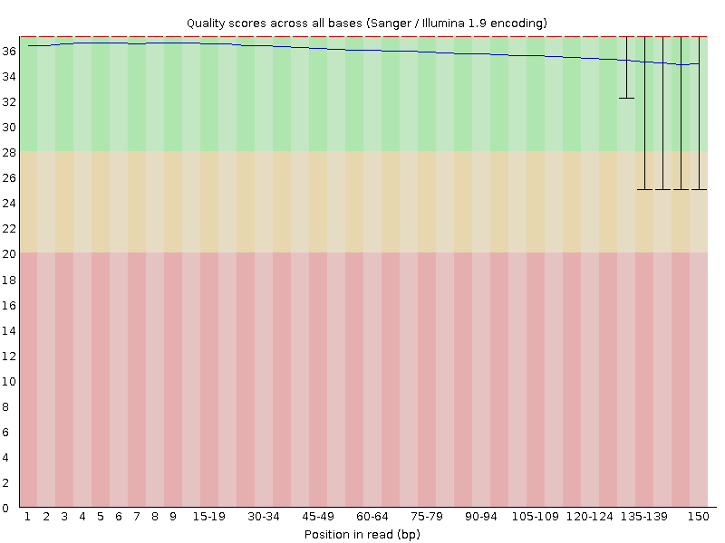
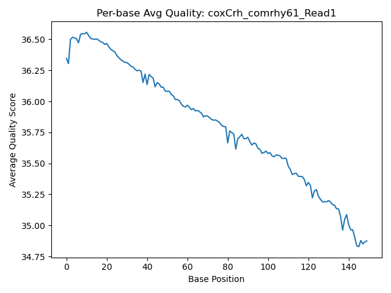
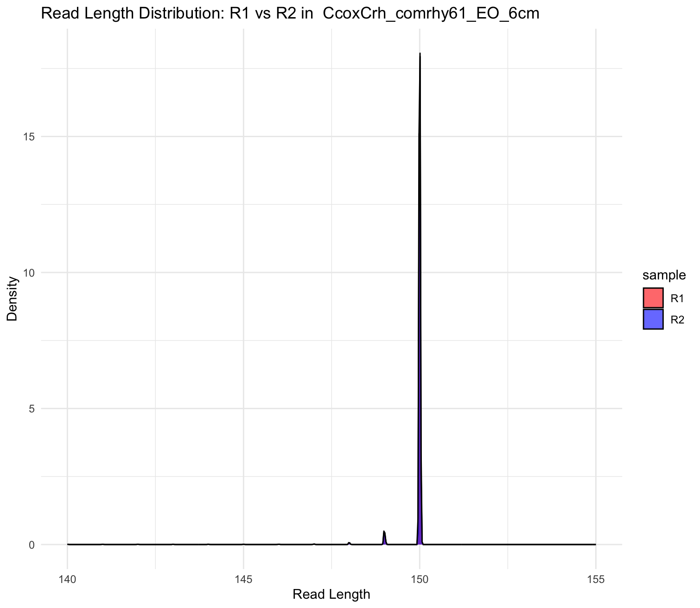

# QAA Report 
## Author: Amanda Dougherty
## Date: 2025-09-07
### RNA-Seq Quality Assessment and Analysis Report: *Mormyrid* Fish Species

* SRR25630296: *Campylomormyrus compressirostris* x *Campylomormyrus rhynchophorus*

CcoxCrh_comrhy61_EO_6cm

Electric organ, 6 cm "age"

*Further abbreviated as Ccom61 in this report*

    spots read      : 43,867,295
            reads read      : 87,734,590
            reads written   : 87,734,590

* SRR25630382: *Campylomormyrus compressirostris* x *Campylomormyrus rhynchophorus*

CcoxCrh_comrhy111_EO_adult

Electric organ, adult "age"

*Further abbreviated as Ccom111 in this report*

    spots read      : 6,975,938
            reads read      : 13,951,876
            reads written   : 13,951,876


## Part 1 – Read quality score distributions

### Part 1.2: FastQC

The per base N content plots from `FastQC` for the four files are shown below. These plots were very consistent with the quality score plots from FastQC as well, indicating that the quality of the reads is generally high, though the ends of the reads decrease in quality. Overall N content was nonexistent for all four reads. 

For **CcoxCrh_comrhy61_EO_6cm_1_1.fastq.gz**:


For **CcoxCrh_comrhy61_EO_6cm_1_2.fastq.gz**


For **CcoxCrh_comrhy111_EO_adult_1_1.fastq.gz**


For **CcoxCrh_comrhy111_EO_adult_1_2.fastq.gz**


**1.3:** Describe how the `FastQC` quality score distribution plots compare to your own. If different, propose an explanation. Also, does the run time differ? Mem/CPU usage? If so, why?

The FastQC qual score plots and my plots are very similar in shape and distribution. Both show a trend of high quality scores at the beginning of the reads, with a gradual decrease in quality towards the end. The main difference that I can tell is that the FastQC plot seems to show the interquartile range (IQR) more clearly with the box plots, while my plot uses a running sum approach which, while it smooths out some of the variability, may not give as clear a picture of the spread of quality scores at each position - especially in regions with high variability like the ends of the reads. Mem/CPU usage and run time for FastQC was slightly higher than my script, as it is a way more comprehensive tool and performed additional analyses beyond just plotting quality scores. 


Fastqc quality score distribution plot example: 




My quality score distribution plot example:




1.4 Comment on the overall data quality of your two libraries. Go beyond per-base qscore distributions. Examine the `FastQC` [documentation](https://www.bioinformatics.babraham.ac.uk/projects/fastqc/Help/3%20Analysis%20Modules/) for guidance on interpreting results and planning next steps. Make and justify a recommendation on whether these data are of high enough quality to use for further analysis. 

[Include comments on data quality and recommendation on whether this can be used for further analysis]


Overall data quality for my two sets of libraries appears to be quite good. The per base sequence quality and per base N content plots indicate a general high quality to all four reads; however, the cross 111 has some questionable quality, particularly with adapter content in R1 and R2. The per sequence GC content plots for all four reads show a normal distribution, which is expected for RNA-Seq data. The sequence duplication levels are also minimal to nonexistent, indicating that there is not an excessive amount of PCR duplication in the libraries. Using these data at this point for further analyses is likely acceptable, but I would recommend trimming the reads to remove low-quality bases and especially adapter contamination (in the case of Ccom111) before proceeding with downstream analyses.


## Part 2 – Adaptor trimming comparison

**2.6** 

**What proportion of reads (both R1 and R2) were trimmed?**

For Ccom111, 21.7% of R1 reads and 21.6% of R2 reads were trimmed. For Ccom61, 8.0% of R1 reads and 8.7% of R2 reads were trimmed. So for both, around the same perecentage of reads were trimmed, with Ccom111 having a higher percentage, which makes sense given the higher adapter content seen in FastQC.

| ID  |  Total Reads |  Reads with Adapters | % |
|-----|--------------|----------------------|---|
|Cc111R1| 6,975,938 | 1,514,521 | 21.7% |
|Cc111R2| 6,975,938 | 1,507,229 | 21.65 |
|Cc61R1 | 43,867,295 | 3,528,795 | 8% |
|Cc61R2 | 43,867,295 | 3,809,704 | 8.7% | 


**111_R1** 

=== Summary ===

Total reads processed:               6,975,938
Reads with adapters:                 1,514,521 (21.7%)
Reads written (passing filters):     6,975,938 (100.0%)

Total basepairs processed: 1,046,390,700 bp
Total written (filtered):  1,006,872,613 bp (96.2%)

**111_R2**

=== Summary ===

Total reads processed:               6,975,938
Reads with adapters:                 1,507,229 (21.6%)
Reads written (passing filters):     6,975,938 (100.0%)

Total basepairs processed: 1,046,390,700 bp
Total written (filtered):  1,008,903,486 bp (96.4%)

**61_R1**


=== Summary ===

Total read pairs processed:         43,867,295
  Read 1 with adapter:               3,528,795 (8.0%)
Pairs written (passing filters):    43,867,295 (100.0%)

Total basepairs processed: 13,160,188,500 bp
  Read 1: 6,580,094,250 bp
  Read 2: 6,580,094,250 bp
Total written (filtered):  13,045,142,790 bp (99.1%)
  Read 1: 6,522,268,610 bp
  Read 2: 6,522,874,180 bp

**61_R2**

=== Summary ===

Total read pairs processed:         43,867,295
Read 2 with adapter:               3,809,704 (8.7%)
Pairs written (passing filters):    43,867,295 (100.0%)

Total basepairs processed: 13,160,188,500 bp
  Read 1: 6,580,094,250 bp
  Read 2: 6,580,094,250 bp
Total written (filtered):  13,045,142,790 bp (99.1%)
  Read 1: 6,522,268,610 bp
  Read 2: 6,522,874,180 bp


8. Trimmed read length distributions for both paired R1 and paired R2 reads. 




For both crosses, the R1 and R2 reads have similar length distributions post-trimming, with most being around 150 bp in length. They both show a main peak at 150bp with a smaller peak visible around 148 bp. No read appears to have been trimmed more extensively than the other. 


**2.9** Ran `FastQC` on the trimmed data to assess if quality improved, especially with adapter sequence report for Ccom111 specifically. 


The sequence quality and specifically the adapter sequence content improved significantly after trimming for Ccom111. The adapter content now reflects just one line at a much lower percentage of reads for both R1 and R2, indicating that the majority of adapter sequences were successfully removed. The per base sequence quality also shows a more consistent high quality across the read length, with less of a drop-off at the ends. Overall, the trimming process has effectively improved the quality of the reads for downstream analyses.


## Part 3 – Alignment and strand-specificity

**3.13**

After generating an alignment database using  *Campylomormyrus compressirostris* genome fasta and gff files, I aligned the trimmed reads from both crosses to the reference genome using `STAR`, before running picard to remove duplicates from the aligned files. Then, I used samtools to covert the bam files to sam files and ran parseSAM.py, a script from PS8, to count the number of mapped and unmapped reads in each file.

Results below:

Ccom61: 
        there are 30,629,343 reads mapped to reference genome
        there are 6,670,637 unmapped reads

Ccom111:

        there are 7,379,569 reads mapped to reference genome
        there are 1,868,658 unmapped reads


**3.15**

After running htseq to count the deduplicated reads that mapped to features, I used bash commands to count how many features were mapped to the genome. For Ccom61 stranded=yes, there were far fewer reads mapped, with 776832 to the forward and 18028922 mapped to the reverse. For Cc111, 176970 mapped to the yes parameter while 3801513 mapped to the reverse. Given the wild disparity between these reads mapped to the genome, we would expect these to be strand-specific libraries. For unstranded, both parameters would result in more equal counts. 

```grep -v "^__" CcoxCrh_comrhy61_EO_6cm_htseqcounts_stranded_yes.txt | awk '{s+=$2} END {print s}'```
776832

```grep -v "^__" CcoxCrh_comrhy61_EO_6cm_htseqcounts_stranded_reverse.txt | awk '{s+=$2} END {print s}'```
18028922

```grep -v "^__" CcoxCrh_comrhy111_EO_adult_htseqcounts_stranded_yes.txt | awk '{s+=$2} END {print s}'```
176970

```grep -v "^__" CcoxCrh_comrhy111_EO_adult_htseqcounts_stranded_reverse.txt | awk '{s+=$2} END {print s}'```
3801513

For differential gene expression analyses, we would use the stranded=reverse parameter for counting reads, as these reads are definitely string-specific as evidenced by the htseq results. 

